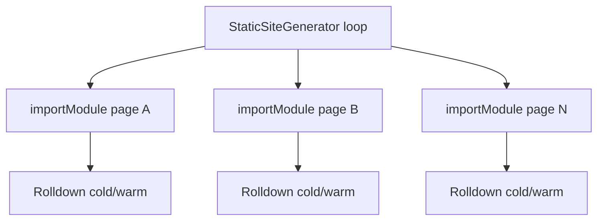

# Unified `pages/` Rolldown graph — PRD

**Status:** Implemented (default on in production; opt out with `ECOPAGES_UNIFIED_PAGES_GRAPH=0`)  
**Depends on:** Build performance Phase 1 complete; Lit static render migration complete

---

## Problem

Static production builds compile **each page module independently**:

Each `PageModuleImportService.importModule()` call may invoke Rolldown with a fresh graph (~24ms cold per page on kitchen-sink, after probe dedupe). Warm disk cache hits are ~0.06ms but cold clean builds still pay N × startup cost.

**Kitchen-sink:** ~15+ static pages × integrations → dozens of `.server-modules` artifacts per clean build.

---

## Goal

One (or few) Rolldown build graphs per app export that:

1. Compile the **entire static route tree** (or integration-specific subgraphs) in a single invocation.
2. Emit per-page chunks with stable cache keys.
3. Reuse the graph across incremental builds via `.eco` cache metadata.
4. Preserve integration boundaries (Kita JSX, React, Lit, MDX plugins).

---

## Non-goals

- Merging browser (client) graphs with server graphs — client Page Browser Graph stays separate.
- Replacing request-time transpilation in dev (HMR keeps per-file graphs).
- Single graph for **dynamic** routes or API handlers.

---

## Proposed architecture

### Phase A — Discovery-only graph (low risk)

**Idea:** One Rolldown build produces a **route manifest** (exports per page file) without rendering.

- Input: all static page entrypoints from `RouteRegistry.listStaticGenerationRoutes()`.
- Output: `.eco/.server-pages-graph/` with chunked ESM + `pages-manifest.json` mapping `filePath → outputPath`.
- `PageModuleImportService` checks manifest first; falls back to per-file Rolldown on miss.

**Win:** Amortize Rolldown startup across pages.  
**Risk:** Plugin ordering across mixed integrations; cache invalidation when any page changes.

### Phase C — Render-time import from graph (implemented)

`PageModuleImportService` imports prebuilt modules from `.eco/.server-pages-graph/.build-cache.json` when the unified graph flag is enabled, skipping per-page Rolldown during static export.

### Phase B — Shared dependency graph

**Idea:** Rolldown `codeSplitting: true` with shared vendor chunk for common imports (`@kitajs/html`, `react`, etc.).

- Align with existing `.server-modules` vs `.server-route-modules` split (documented in `packages/core/src/build/README.md`).
- Unify outdirs only if build options + plugin stacks are identical (Phase 1D proof).

### Phase C — Render-time import from graph

SSG loop imports prebuilt modules from graph outputs only — no per-page Rolldown during `generateStaticPages`.

---

## Cache & invalidation

Extend patterns from `server-entry-build-cache.ts`:

| Input fingerprint                         | Invalidates       |
| ----------------------------------------- | ----------------- |
| Page file content hash                    | That page’s chunk |
| Integration plugin list + versions        | Whole graph       |
| `createBuildInputsFingerprint(appConfig)` | Whole graph       |
| `force` flag                              | Whole graph       |

Store metadata in `.eco/.server-pages-graph/.build-cache.json` (not `dist/`).

---

## Integration constraints

| Integration  | Constraint                                                                                       |
| ------------ | ------------------------------------------------------------------------------------------------ |
| Kita         | JSX plugin ownership per file                                                                    |
| React        | Server components, MDX loader boundaries                                                         |
| Lit          | SSR preload session must run before graph import (see [Lit migration](../lit/migration-plan.md)) |
| MDX          | Compiled through integration-specific loader                                                     |
| Ecopages-JSX | Radiant / eco runtime                                                                            |

**Spike:** kitchen-sink pages-only graph with Kita + one React page; measure cold build delta.

---

## Success metrics

| Metric                                           | Baseline                | Target                         |
| ------------------------------------------------ | ----------------------- | ------------------------------ |
| Rolldown invocations (clean build, kitchen-sink) | ~N pages + server entry | **1–3** (graph + server entry) |
| Cold route-module segment (bench)                | ~24ms × N               | **< 200ms** total graph        |
| Correctness                                      | current SSG output      | identical HTML/assets          |

---

## Delivery order

1. **Bench (done):** `ECOPAGES_ROLLDOWN_BUILD_METRICS=1` + `getPageModuleRolldownBuildInvocations()` for per-page route-module builds during SSG.
2. **Spike (done):** `pages-unified-graph-build.ts` — one Rolldown call for all static template routes; Phase C imports via `PageModuleImportService`.
3. **Kitchen-sink (done):** eligibility covers all `templatesExt` integrations (Kita, React, Lit, MDX, Ecopages-JSX).
4. **Default on (done):** production builds enable the graph unless `ECOPAGES_UNIFIED_PAGES_GRAPH=0`.

## Environment flags

| Flag                                | Purpose                                                        |
| ----------------------------------- | -------------------------------------------------------------- |
| `ECOPAGES_UNIFIED_PAGES_GRAPH=0`    | Disable unified graph (escape hatch)                           |
| `ECOPAGES_UNIFIED_PAGES_GRAPH=1`    | Force enable (redundant in production after default-on)        |
| `ECOPAGES_ROLLDOWN_BUILD_METRICS=1` | Count Rolldown `build()` and per-page route-module invocations |

## Future work

- **Phase B:** shared vendor chunks across pages in the unified graph
- **Per-page graph invalidation:** rebuild only changed page chunks instead of the whole graph

---

## Related work

- Build performance plan (probe dedupe, server-entry cache) — completed in core
- [Lit migration plan](../lit/migration-plan.md) — remove fetch server first (higher ROI, lower risk)
