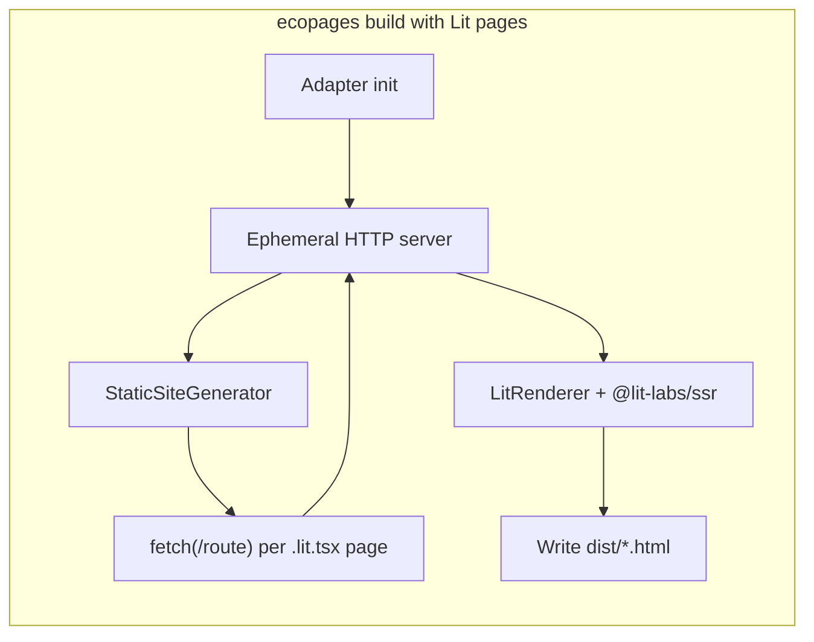
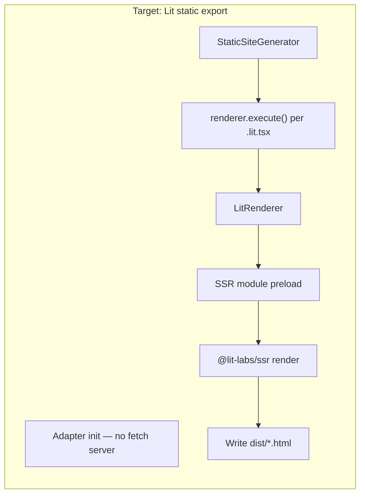

# Lit static export migration plan

**Status:** Implemented  
**Owner:** Ecopages core + `@ecopages/lit`  
**Target:** Remove `staticBuildStep: 'fetch'` for Lit without losing static HTML fidelity

---

## Problem

### Today

- `LitPlugin` sets `staticBuildStep: 'fetch'` in `packages/integrations/lit/src/lit.plugin.ts`.
- Node/Bun adapters start a **live server** whenever any integration uses fetch-based static builds.
- `StaticSiteGenerator` HTTP-fetches each Lit route instead of calling `RouteRendererFactory.execute()` directly.
- Fetch routes **opt out** of static HTML reuse cache (`reuseRenderedOutput: false`).

Kitchen-sink impact: Lit forces the ephemeral server on every production build (~seconds of wall time, serial HTTP round-trips, full routing stack per page).

### Why fetch exists

Historical constraints (still partly true):

1. Lit page roots are rendered inside `LitRenderer.render()` with document shell, asset injection, hydrate scripts, and foreign-subtree resolution — not via a minimal `execute()` probe path.
2. Custom elements in separate `.script.ts` files must be registered before SSR (`LitSsrLazyPreloader`).
3. Cross-integration pages (`eco.embed()` of Kita/React/Lit) need the full orchestration graph.
4. Team chose fetch to reuse the **exact** request-time pipeline rather than duplicating it for SSG.

### What already works without fetch

- **Embedded Lit** in Kita/React pages: parent uses `render` strategy; `LitRenderer` still runs `@lit-labs/ssr` during normal `execute()`.
- **Runtime requests**: full SSR stack is implemented (`dom-shim.ts`, `renderLitValueToString`, hydrate injection).

The gap is **Lit-first page routes** (`.lit.tsx` files) in the static export loop.

---

## Reference: Eleventy + Lit pattern

Lit’s official Eleventy plugin ([`@lit-labs/eleventy-plugin-lit`](https://github.com/lit/lit/blob/c42ee1e96b8fd61f7256f61d715daef572e76e52/packages/labs/eleventy-plugin-lit/src/index.ts)) does **not** HTTP-fetch pages. It:

1. **Preloads component modules** once per build (`componentModules` list) via `@lit-labs/ssr/lib/module-loader.js` (VM) or a worker thread.
2. **Transforms HTML** after other generators run: finds Lit template markers in HTML and calls `@lit-labs/ssr/lib/render-lit-html.js` with `unsafeHTML` to SSR the template regions.
3. **Trims outer SSR markers** (`<!--lit-part …-->`, `<?>`) that are artifacts of nested template boundaries.

Two modes:

| Mode     | Mechanism                              | Trade-off                                 |
| -------- | -------------------------------------- | ----------------------------------------- |
| `worker` | Dedicated worker, message protocol     | Isolation, no `--experimental-vm-modules` |
| `vm`     | `ModuleLoader` + `render()` in Node VM | Faster warm builds, needs ESM VM support  |

**Lesson for Ecopages:** SSR happens **in-process** against a pre-warmed module graph, not over HTTP.

---

## Target architecture

### Product contract (unchanged)

- Static `.lit.tsx` routes produce the **same HTML** as `curl` against a dev/preview server for the same app revision.
- Hydration scripts and declarative shadow DOM attributes remain correct.
- Foreign subtrees (`eco.embed`) resolve identically.
- `ecopages build` must **not** require a listening HTTP port for Lit-only apps.

### Code contract changes

| Area                            | Today                                    | Target                         |
| ------------------------------- | ---------------------------------------- | ------------------------------ |
| `LitPlugin.staticBuildStep`     | `'fetch'`                                | `'render'` (default)           |
| `NodeServerAdapter.buildStatic` | Starts server if any `fetch` integration | Skips server for Lit-only apps |
| `StaticSiteGenerator`           | `fetch()` branch for Lit                 | `renderer.execute()` only      |
| Lit static HTML cache           | Disabled for fetch                       | Re-enable incremental reuse    |

---

## Migration phases

### Phase 0 — Measure & guardrails (1 PR)

**Goal:** Prove parity before flipping the switch.

- [x] Add kitchen-sink bench segment: Lit page via fetch vs direct render (behind feature flag).
- [x] Snapshot tests: `lit-entry.lit.tsx` HTML from fetch path vs render path (normalize markers).
- [x] E2E: existing integration-matrix Lit scenarios stay green.

**Files:** `playground/kitchen-sink/bench/`, `packages/integrations/lit/src/test/`, `e2e/`.

### Phase 1 — Render-path parity for Lit page routes (2–3 PRs)

**Goal:** Make `renderer.execute()` sufficient for `.lit.tsx` static export.

1. **SSR preload session**
    - [x] Introduce `LitStaticRenderSession` modeled on Eleventy’s `eleventy.before` hook:
        - Collect all `.lit.tsx` page entrypoints + referenced custom-element scripts from route graph.
        - Preload via existing `LitSsrLazyPreloader` + optional worker for `.script.ts` registrations.
        - Scope: one session per `StaticSiteGenerator.run()` (not per page).
    - Files: `packages/integrations/lit/src/lit-static-render-session.ts`, `lit-renderer.ts`, `lit-ssr-lazy-preloader.ts`.

2. **Static export orchestration hook**
    - [x] `StaticSiteGenerator.run()` calls integration hook `beforeStaticExport?` / `afterStaticExport?` on plugins with `staticBuildStep: 'render'`.
    - [x] Lit plugin starts preload session in `before`, tears down in `after`.

3. **Foreign subtree + document shell**
    - [x] Verify `LitRenderer.render()` path used by `execute()` produces byte-identical output to fetch path for kitchen-sink matrix.
    - [x] Fix gaps: metadata, layout props, asset ordering, `normalizeLitHtml` marker trimming (Eleventy’s `trimOuterMarkers` equivalent).

4. **Worker rendering**
    - [x] Lit static export always renders through `lit-static-render-worker.ts`.

### Phase 2 — Flip default & remove fetch (1 PR)

- [x] Change `LitPlugin` default to `staticBuildStep: 'render'`.
- [x] Remove ephemeral build server requirement from kitchen-sink cold build bench.
- [x] Update docs: `apps/docs/src/pages/docs/integrations/lit.mdx`.
- [x] Lit no longer uses `staticBuildStep: 'fetch'`.

### Phase 3 — Optional Eleventy-style worker mode (spike)

- [x] Worker thread running Lit static render bootstrap via `lit-static-render-worker.ts`.

---

## Risks & mitigations

| Risk                                        | Mitigation                                                                                  |
| ------------------------------------------- | ------------------------------------------------------------------------------------------- |
| Custom elements not registered before SSR   | Extend `LitSsrLazyPreloader`; scan route graph for `dependencies.scripts` with `ssr: true`  |
| `eco.embed()` ordering differs without HTTP | Integration test matrix page; compare DOM snapshots                                         |
| Hydration mismatch                          | Keep vendored `lit-element-hydrate-support`; assert hydrate script in static HTML snapshots |
| Bun vs Node SSR divergence                  | Run kitchen-sink build on both runtimes in CI                                               |
| Memory: preloading all Lit modules          | Bounded session; release after `StaticSiteGenerator.run()`                                  |

---

## Success metrics

| Metric                          | Baseline (kitchen-sink, Node) | Target                                              |
| ------------------------------- | ----------------------------- | --------------------------------------------------- |
| Cold `ecopages build` wall time | ~8s                           | **−1.5–3s** (no ephemeral server + fewer HTTP hops) |
| `buildStatic` segment (bench)   | ~4.5s cold                    | measurable drop                                     |
| Lit static HTML                 | fetch reference               | **byte-equal** (modulo timestamps)                  |
| `requiresFetchRuntime` apps     | kitchen-sink                  | **0** for default Lit config                        |

---

## Out of scope (this migration)

- Replacing `@lit-labs/ssr` with a different SSR engine.
- Compile-time SSR for **embedded** Lit only (already works).
- Unified `pages/` Rolldown graph (see [pages unified graph PRD](../build/pages-unified-graph.md)).

---

## Open questions

1. **Generic `beforeStaticExport` hook** vs Lit-only special case in core?
2. Should `.lit.tsx` pages that only re-export Kita shells stay `.lit.tsx` or move to Kita for simpler SSG?
3. Do we need Eleventy-style post-HTML transform for MDX/Kita pages that inline Lit template literals, or only for Lit-first routes?

---

## Related code

| Path                                                                     | Role                       |
| ------------------------------------------------------------------------ | -------------------------- |
| `packages/integrations/lit/src/lit.plugin.ts`                            | `staticBuildStep: 'fetch'` |
| `packages/integrations/lit/src/lit-renderer.ts`                          | SSR render path            |
| `packages/integrations/lit/src/utils/lit-html-rendering.ts`              | `@lit-labs/ssr`            |
| `packages/core/src/static-site-generator/static-site-generator.ts`       | Fetch vs render branch     |
| `packages/core/src/adapters/node/server-adapter.ts`                      | Ephemeral build server     |
| `playground/kitchen-sink/src/pages/integration-matrix/lit-entry.lit.tsx` | Canonical Lit page         |
