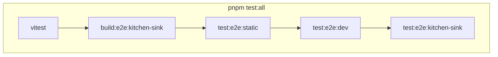

# E2E Test Plan

**Status:** Accepted  
**Last updated:** 2026-06-27

---

## Policy

1. **Three tiers.** Pre-commit runs `test:pre-commit` (vitest + lint + typecheck, no Playwright). PRs run `test:ci` (vitest + `test:e2e:pr`). `main`/publish run `test:all` (vitest + full e2e). Playwright coverage is listed in root `package.json` (`test:e2e:static`, `test:e2e:dev`, `test:e2e:kitchen-sink`).
2. **Cross-integration certifies host/runtime parity without a full matrix.** One canonical dev project (ecopages + **node**) runs the full behavioral suite. Each other cell (ecopages+bun, vite+node, vite+bun) runs only the `@parity` document-navigation spec at `workers: 1`. Preview runs on bun and node static builds. This keeps every runtime/host parity-certified without repeating ~20 specs per cell (the old flaky model).
3. **Rapid-navigation stays stressful.** Use `fireRapidLinkClicks` (overlapping navigations). Pacing every hop with full document waits stops testing SSR under load.
4. **Three Playwright runs for the full suite.** `test:e2e:static` (one subprocess, parallel static/preview), `test:e2e:dev` (fixture dev servers), `test:e2e:kitchen-sink` (one subprocess per kitchen-sink cell — dev servers must not boot together). Kitchen-sink `dist/` is built once in shell before Playwright (`build:e2e:kitchen-sink`).
5. **Preview vs dev is capability-based.** Tests move to preview only when static output can serve them. API handlers, middleware locals, WebSockets, and HMR stay on dev/HMR projects.
6. **Native Playwright.** Use `playwright test --project`, `--grep`, and `package.json` scripts. No custom test runner wrapper.

---

## Commands

| Command                            | Runs                                                                                |
| ---------------------------------- | ----------------------------------------------------------------------------------- |
| `pnpm test:pre-commit`             | `test:vitest` + lint + lint-staged + typecheck (no Playwright)                      |
| `pnpm test:ci`                     | `test:vitest` + `test:e2e:pr` (PR gate)                                             |
| `pnpm test:all`                    | `test:vitest` + full `test:e2e`                                                     |
| `pnpm test:gate`                   | `test:vitest` + stress smoke (`--project cross-integration-dev-e2e --grep @stress`) |
| `pnpm test:vitest`                 | Vitest `shared-core` + `browser`                                                    |
| `pnpm test:e2e`                    | `build:e2e:kitchen-sink` + static + dev + kitchen-sink runs                         |
| `pnpm test:e2e:pr`                 | PR subset (no node preview, no HMR, canonical dev grepped)                          |
| `playwright test --project <name>` | Single project — local debug                                                        |
| `pnpm test:e2e:ui`                 | Playwright UI mode                                                                  |

Pre-commit: `pnpm test:pre-commit`. PR CI (`.github/workflows/ci.yml`): `pnpm test:ci`. Publish/main (`.github/workflows/publish.yml`): `pnpm test:all`.

---

## Playwright projects (17 total)

Defined in `playwright.config.ts`. Executed via `package.json` scripts — see [E2E runs](#e2e-runs-packagejson). PR gate (`test:e2e:pr`) skips node preview and HMR; greps canonical dev to `@content|@stress|@parity`.

| Project                                  | Fixture / app                                             | In-project workers |
| ---------------------------------------- | --------------------------------------------------------- | ------------------ |
| `core-hmr-dev-e2e`                       | `e2e/fixtures/core-hmr` (dev)                             | **`1`**            |
| `core-hmr-postcss-dev-e2e`               | `e2e/fixtures/core-hmr` (dev + PostCSS)                   | **`1`**            |
| `core-hmr-static-e2e`                    | `e2e/fixtures/core-hmr` (build+preview)                   | `N`                |
| `browser-router-e2e`                     | `e2e/fixtures/browser-router` (preview)                   | `N`                |
| `docs-e2e`                               | `@ecopages/docs`                                          | `N`                |
| `react-router-e2e`                       | `e2e/fixtures/react-router` (preview)                     | `N`                |
| `react-router-persist-layouts-e2e`       | same (preview, persist layouts)                           | `N`                |
| `react-router-persist-layouts-dev-e2e`   | same (dev, persist layouts)                               | **`1`**            |
| `cache-e2e`                              | `e2e/fixtures/cache`                                      | `N`                |
| `react-dev-e2e`                          | `playground/react`                                        | `N`                |
| `cross-integration-preview-e2e`          | `playground/kitchen-sink` (bun preview)                   | `N`                |
| `cross-integration-node-preview-e2e`     | `playground/kitchen-sink` (node preview)                  | `N`                |
| `cross-integration-dev-e2e`              | `playground/kitchen-sink` (ecopages+node dev, full suite) | **`1`**            |
| `cross-integration-hmr-e2e`              | `playground/kitchen-sink` (HMR)                           | **`1`**            |
| `cross-integration-bun-parity-e2e`       | `playground/kitchen-sink` (ecopages+bun, @parity)         | **`1`**            |
| `cross-integration-vite-node-parity-e2e` | `playground/kitchen-sink` (vite+node, @parity)            | **`1`**            |
| `cross-integration-vite-bun-parity-e2e`  | `playground/kitchen-sink` (vite+bun, @parity)             | **`1`**            |

`N` = `os.availableParallelism()`. Run layout: [E2E runs](#e2e-runs-packagejson).

---

## Capability fixtures (`e2e/fixtures/*/fixture.e2e.ts`)

Each integration block gets a **focused fixture app** under `e2e/fixtures/<block>/` with a self-describing `fixture.e2e.ts` module. Root `playwright.config.ts` discovers these modules and composes their Playwright projects and web servers.

Register each fixture in `e2e/playwright/capability-fixture-registry.ts`, then add its Playwright project name to the matching `package.json` e2e script.

Test filename suffixes select the mode where applicable:

| Pattern                     | Runs on                                |
| --------------------------- | -------------------------------------- |
| `*.dev.test.e2e.ts`         | dev only                               |
| `*.static.test.e2e.ts`      | static only                            |
| `*.postcss.dev.test.e2e.ts` | PostCSS dev only                       |
| `*.test.e2e.ts`             | per project `testMatch` / `testIgnore` |

### Block map

| Block             | Fixture dir                      | Status                                  |
| ----------------- | -------------------------------- | --------------------------------------- |
| core-hmr          | `e2e/fixtures/core-hmr`          | **done**                                |
| browser-router    | `e2e/fixtures/browser-router`    | **done**                                |
| react-router      | `e2e/fixtures/react-router`      | **done**                                |
| cache             | `e2e/fixtures/cache`             | **done**                                |
| react             | `e2e/fixtures/react`             | **done**                                |
| docs              | `e2e/fixtures/docs`              | **done**                                |
| cross-integration | `e2e/fixtures/cross-integration` | **done** (replaces kitchen-sink matrix) |
| css               | `e2e/fixtures/css`               | planned                                 |
| lit               | `e2e/fixtures/lit`               | planned                                 |
| images-mdx        | `e2e/fixtures/images-mdx`        | planned                                 |

---

## E2E runs (`package.json`)

```text
pnpm build:e2e:kitchen-sink     # ~10s, once before preview tests

pnpm test:e2e:static            # one playwright test (8 projects, parallel)
pnpm test:e2e:dev               # one playwright test (4 fixture dev projects)
pnpm test:e2e:kitchen-sink      # run-each-project.mjs (dev, 3× parity, HMR)

pnpm test:e2e                   # build + all three
pnpm test:e2e:pr                # PR: static:pr + dev + kitchen-sink:pr
```

Kitchen-sink preview uses in-repo `dist/` (`start-kitchen-sink-preview-server.mjs`). Isolated dev/HMR/parity use `.e2e-tmp/` via `run-isolated-app.mjs`. `.e2e-tmp` is cleared once at the start of `test:e2e:kitchen-sink` (`clean:e2e-tmp`).

### In-project workers (`playwright.config.ts`)

| Project group                                  | `workers`      | Rationale                                |
| ---------------------------------------------- | -------------- | ---------------------------------------- |
| `core-hmr-dev-e2e`, `core-hmr-postcss-dev-e2e` | **`1`**        | Dev HMR mutates source files on disk     |
| `core-hmr-static-e2e`                          | `N`            | Static build output                      |
| `browser-router-e2e`, `docs-e2e`, `cache-e2e`  | `N`            | Preview/static or low-contention servers |
| `react-router-*`, `react-dev-e2e`              | `N` or **`1`** | Static = `N`; dev = **`1`**              |
| `cross-integration-preview-e2e`                | `N`            | Pre-built static output; serve only      |
| `cross-integration-dev-e2e`                    | **`1`**        | One shared SSR server per run            |
| `cross-integration-*-parity-e2e`               | **`1`**        | Isolated workspace each                  |
| `cross-integration-hmr-e2e`                    | **`1`**        | Mutates shared source files on disk      |

### Verification (do not regress)

| Config                            | `cross-integration-dev-e2e` result                           |
| --------------------------------- | ------------------------------------------------------------ |
| `workers: N` (10 on this machine) | **15/22 failed** — SSR queue collapse, WS timeouts, `ENOENT` |
| `workers: 1`                      | **22/22 passed** (~3.2 min)                                  |
| `workers: N` on preview           | **17/17 passed** (~1.4 min)                                  |

**Rule:** Do not raise cross-integration dev/HMR in-project workers until dev SSR has a warm per-route cache. Raising static/preview workers is fine.

### Do not

- Set cross-integration **dev** to `workers: N` to "speed up" — it overloads one SSR server.
- Run multiple kitchen-sink dev servers in one Playwright process (use `run-each-project.mjs`).
- Use paced full reloads in rapid-navigation **stress** tests to compensate for dev slowness.

---

## Cross-integration inventory

Full-gate cross-integration executions: canonical ecopages+node dev suite (all `*.test.e2e.ts` incl. `@parity`) + 3 parity cells (1 `@parity` test each) + 2 hmr + 12 preview (bun + node).

### Preview (`*.preview.test.e2e.ts`) — bun + node

| File                                      | Tests | Notes                                                                                                                   |
| ----------------------------------------- | ----- | ----------------------------------------------------------------------------------------------------------------------- |
| `integration-matrix.preview.test.e2e.ts`  | 8     | One combined interactivity test per host entry (kita, react, lit, ecopages-jsx); SSR markup + hydration on static build |
| `preview-regressions.preview.test.e2e.ts` | 4     | JSX markers, CSS assets, vendor bundles, Lit SSR                                                                        |

Timeout: 60 s (project) · Workers: `availableParallelism()`

### Dev (`*.test.e2e.ts`, excluding HMR) — canonical ecopages+node full suite

| File                                   | Tests | Notes                                                                                            |
| -------------------------------------- | ----- | ------------------------------------------------------------------------------------------------ |
| `api-lab.test.e2e.ts`                  | 2     | Browser rebind + `/api/v1/*` requests                                                            |
| `parity.test.e2e.ts`                   | 1     | `@parity`; sequential document navigation across shell routes (`parity-routes.ts`)               |
| `rapid-navigation.stress.test.e2e.ts`  | 3     | Full traversal + 2 cross-tech sequences; `@stress`; `fireRapidLinkClicks`                        |
| `rapid-navigation.content.test.e2e.ts` | 2     | Final-hop content assertions; `@content`; `recoverToPath` + `pollTestIdVisible` after rapid hops |
| `routes-and-shell.test.e2e.ts`         | 3     | Shell, explicit routes, catalog, 404 tour                                                        |
| `runtime-surfaces.test.e2e.ts`         | 3     | Middleware locals, images/transitions, PostCSS page                                              |
| `ws-chat.test.e2e.ts`                  | 7     | WebSocket UI + broadcast (per-worker room IDs)                                                   |

Timeout: 90 s (project) · Workers: `1`. The `@parity` spec also runs on each non-canonical cell (bun, vite+node, vite+bun) as their only test.

### HMR (`includes-hmr.test.e2e.ts`) — all four hosts

| Tests | Notes                                                           |
| ----- | --------------------------------------------------------------- |
| 2     | Serial describe; mutates include + explicit-route files on disk |

Ready signals: dev servers log `Bun server running at …` or `Node server running at …` via `appLogger`; Playwright matches that stdout line. Preview-only servers (for example docs-e2e) use port-open readiness instead.  
Timeout: 90 s · Workers: `1`

### Timeouts in tests

Project defaults live in `playwright.config.ts`. Do not add per-test `test.setTimeout` overrides unless a single case needs more than the project default (e.g. `api-lab` rebind test uses 120 s).

---

## Cross-integration Playwright patterns

Tests use **plain Playwright** — no custom navigation framework. Shared helpers live in `playground/kitchen-sink/e2e/test-support.ts` and are re-exported from `helpers.ts`.

### Navigation

| Helper                            | Use                                                                                           |
| --------------------------------- | --------------------------------------------------------------------------------------------- |
| `gotoPath(page, href)`            | Resilient `page.goto` with retry on `net::ERR_ABORTED` (`waitUntil: 'commit'`)                |
| `recoverToPath(page, href)`       | After rapid in-app hops: wait for morph idle → `gotoPath` → wait idle again                   |
| `waitForNavigationIdle(page)`     | Poll `__ECO_PAGES__.navigation.hasPendingNavigationTransaction()` until false                 |
| `fireRapidLinkClicks(page, hops)` | Stress/content recovery — DOM clicks via `page.evaluate` (prefers `data-testid` on nav links) |

### Assertions

| Helper                                               | Use                                                                                                         |
| ---------------------------------------------------- | ----------------------------------------------------------------------------------------------------------- |
| `pollTestIdVisible(page, testId)`                    | Poll `page.evaluate` for `[data-testid]` visibility — avoids Playwright navigation-gate stalls during morph |
| `getPageTestId(href)` / `getPrimaryLinkTestId(href)` | Stable selectors from `src/data/primary-links.ts`                                                           |
| `trackRuntimeErrors(page)`                           | Capture page/console errors; call `assertClean()` at end of stress/content tests                            |
| `requestGetAndWait`                                  | Retry GET until 200 (preview warmup)                                                                        |

### Stress vs content

- **Stress (`@stress`):** `gotoPath` → `fireRapidLinkClicks` → `trackRuntimeErrors.assertClean()` — no content waits mid-sequence.
- **Content (`@content`):** rapid hops → `recoverToPath(finalHref)` → `pollTestIdVisible(getPageTestId(...))` (or `expect.poll` + `page.evaluate` for text).
- **Realtime (`@realtime`):** isolated room IDs per worker; ws-chat runs serial within its describe.

### `data-testid` hooks

Pages and shell expose `data-testid` where role/text selectors are unstable under morph (e.g. `kitchen-sink-shell`, `page-{route}`, `theme-toggle`, `data-chat-connected-username` on ws-chat status).

---

## Helpers (`playground/kitchen-sink/e2e/helpers.ts`)

Re-exports `counters.ts`, `layout.ts`, and `test-support.ts`. Import navigation/assertion helpers from `./test-support` or `./helpers`.

---

## Harness



PR gate (`test:e2e:pr`) uses `test:e2e:static:pr` and `test:e2e:kitchen-sink:pr` (no node preview, no HMR, canonical dev grepped).

**Preview:** in-repo `dist/`, `start-kitchen-sink-preview-server.mjs` (serve only).

**Isolated dev/HMR/parity:** `run-isolated-app.mjs` copies into `.e2e-tmp/<workspace>`, sets `ECOPAGES_CROSS_INTEGRATION_E2E`, scopes artifacts via `ECOPAGES_E2E_ARTIFACT_SCOPE` → `dist-${scope}` / `.eco-${scope}`.

---

## Preview vs dev placement

| Preview                                              | Dev / HMR                                                            |
| ---------------------------------------------------- | -------------------------------------------------------------------- |
| `integration-matrix` (static SSR + client hydration) | `routes-and-shell`, `runtime-surfaces` (middleware, explicit routes) |
| `preview-regressions`                                | `api-lab` (live `/api/v1/*`)                                         |
|                                                      | `rapid-navigation`, `ws-chat`, `includes-hmr`                        |

**Cannot move to preview** (returns HTML or lacks request scope): API routes, middleware locals, WebSockets.

**Vite hosts:** integration-matrix runs on bun/node preview only until vite preview projects exist. Vite dev is covered by the vite+node and vite+bun parity cells (`@parity` spec).

**Do not** point multiple concurrently-running kitchen-sink dev servers at the same workspace. Preview uses in-repo source; dev/HMR/parity use `run-each-project.mjs` (one server per Playwright process).

---

## Stability constraints (do not regress)

| Change                                           | Observed result                                                                       |
| ------------------------------------------------ | ------------------------------------------------------------------------------------- |
| `workers: N` on cross-integration dev            | 15/22 failed (SSR overload)                                                           |
| `workers: 1` on cross-integration dev            | 22/22 passed                                                                          |
| Multiple dev servers without workspace isolation | `ENOENT` on `.tmp.js`, HMR timeouts                                                   |
| Paced clicks in rapid-navigation stress          | ~90 s+ traversal; stops testing overlap                                               |
| Playwright locator assertions during morph       | "waiting for navigation to finish" — use `pollTestIdVisible` or `page.evaluate` polls |

---

## Wall-clock (rough)

Capture timings with `ECOPAGES_E2E_TIMING=true pnpm test:e2e`. Lines prefixed `[e2e-timing]` report per-wave durations. Re-run after orchestration changes to verify regressions.

| Scope                                  | Target       | Notes                                      |
| -------------------------------------- | ------------ | ------------------------------------------ |
| Vitest                                 | ~1–3 min     |                                            |
| Static run (`test:e2e:static`)         | ~1–2 min     | N workers; kitchen-sink preview serve-only |
| Dev run (`test:e2e:dev`)               | ~2–5 min     | Fixture dev servers in one process         |
| Kitchen-sink (`test:e2e:kitchen-sink`) | ~5–15 min    | One Playwright process per cell            |
| **PR `test:ci`**                       | **< 12 min** | Vitest + `test:e2e:pr`                     |
| **Full `test:all`**                    | **< 20 min** | Vitest + `test:e2e`                        |
| Stress smoke (`test:gate`)             | < 5 min      | Vitest + 1 project stress subset           |

Empirical dev-worker ceiling (do not regress): `workers: N` on cross-integration dev → **15/22 failed**; `workers: 1` → **22/22 passed**.

---

## Debug shortcuts

Not substitutes for `test:all`. Full env-var reference: [`e2e/README.md`](../e2e/README.md).

| Shortcut                                                          | Effect                                      |
| ----------------------------------------------------------------- | ------------------------------------------- |
| `playwright test --project <name>`                                | One Playwright project                      |
| `playwright test --grep @stress`                                  | Filter by behavior tag                      |
| `pnpm test:e2e:ui`                                                | Interactive mode                            |
| `ECOPAGES_E2E_TIMING=true pnpm test:e2e`                          | Full gate with `[e2e-timing]` per-wave logs |
| `ECOPAGES_REUSE_TEST_SERVERS=true pnpm test:e2e --project <name>` | Reuse already-running servers               |

---

## Failure triage

| Symptom                                       | Likely cause                                                                                  |
| --------------------------------------------- | --------------------------------------------------------------------------------------------- |
| "browser has been closed" cascade             | One test hit the project timeout                                                              |
| `ENOENT` on `.tmp.js`                         | Too many dev workers or multiple cross-integration servers at once                            |
| HMR connect timeout                           | Server not ready; verify single-project wave                                                  |
| Preview API returns HTML                      | Test belongs on dev, not `*.preview.test.e2e.ts`                                              |
| Slow rapid-navigation                         | Accidentally awaiting content on every stress hop                                             |
| "waiting for navigation to finish" on locator | In-flight browser-router morph — use `recoverToPath`, `pollTestIdVisible`, or `page.evaluate` |

---

## Summary

`pnpm test:all` = Vitest + `build:e2e:kitchen-sink` + three Playwright runs (`static`, `dev`, `kitchen-sink`). `pnpm test:ci` uses the PR variants. Dev servers use `wait.stdout` readiness (not `GET /`) so Playwright does not pay a cold SSR tax before tests start.
