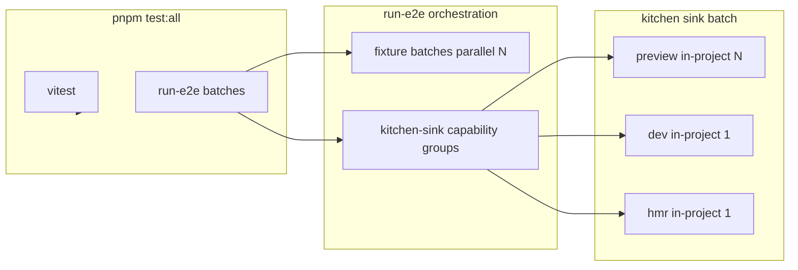

# E2E Test Plan

**Status:** Accepted  
**Last updated:** 2026-06-24

---

## Policy

1. **`pnpm test:all` is the only test gate.** Pre-commit, `prerelease`, and the publish workflow all invoke it. Change Playwright coverage in one place: `e2e/scripts/playwright/run-e2e.mjs`.
2. **Full kitchen-sink matrix on every run.** Ten Playwright projects (bun/node/vite × dev/hmr/preview where applicable). No alternate script or flag trims the suite.
3. **Rapid-navigation stays stressful.** Use `fireRapidLinkClicks` (overlapping navigations). Pacing every hop with full document waits stops testing SSR under load.
4. **Max parallelism — two layers.** See [Parallelism and workers](#parallelism-and-workers-legacy-batch-note). Fixture batches run concurrently; kitchen-sink runs as parallel isolated processes by capability group; dev/HMR stay at in-project `workers: 1`.
5. **Preview vs dev is capability-based.** Tests move to preview only when static output can serve them. API handlers, middleware locals, WebSockets, and HMR stay on dev/HMR projects.

---

## Commands

| Command | Runs |
| ------- | ---- |
| `pnpm test:all` | `test:vitest` + full `test:e2e` |
| `pnpm test:vitest` | Vitest `shared-core` + `browser` |
| `pnpm test:e2e` | All Playwright batches below |
| `pnpm test:e2e:smoke` | Cross-host stress (`bun` + `vite-node`, `@stress`) |
| `pnpm test:e2e:stress` | Kitchen-sink rapid stress only (`@stress`) |
| `pnpm test:e2e:kitchen` | Full kitchen-sink matrix (capability groups) |
| `pnpm test:e2e:baseline` | Full gate with `[e2e-timing]` wall-clock logs |
| `pnpm test:e2e --project <name>` | Single project — debug only |
| `pnpm test:e2e:ui` | Playwright UI mode |

Pre-commit: `pnpm test:all`, then lint, lint-staged, typecheck.

---

## Playwright projects (19 total)

Defined in `playwright.config.ts`, executed via batched `run-e2e.mjs`.

| Project | Fixture / app | In-project workers |
| ------- | ------------- | ------------------ |
| `core-e2e` | `packages/core/__fixtures__/app` | `N` |
| `core-postcss-e2e` | core PostCSS routes | `N` |
| `browser-router-e2e` | `e2e/fixtures/browser-router-app` | `N` |
| `docs-e2e` | `@ecopages/docs` | `N` |
| `react-router-e2e` | `e2e/fixtures/react-router-app` (preview) | `N` |
| `react-router-persist-layouts-e2e` | same (preview, persist layouts) | `N` |
| `react-router-persist-layouts-dev-e2e` | same (dev, persist layouts) | `N` |
| `cache-e2e` | `e2e/fixtures/cache-app` | `N` |
| `react-playground-e2e` | react playground fixture | `N` |
| `kitchen-sink-*-preview-e2e` | `playground/kitchen-sink` (preview) | `N` |
| `kitchen-sink-*-e2e` (dev) | `playground/kitchen-sink` (dev) | **`1`** |
| `kitchen-sink-*-hmr-e2e` | `playground/kitchen-sink` (HMR) | **`1`** |

`N` = `os.availableParallelism()`. Batch orchestration: [Parallelism and workers](#parallelism-and-workers).

Kitchen-sink variants without a preview port today: **vite-node**, **vite-bun** (dev + HMR only).

---

## Capability groups (`run-e2e.mjs`)

Fixture batches run in parallel (up to `availableParallelism()`). Kitchen-sink projects run as **parallel isolated processes** grouped by capability. Read-only dev/preview projects share one `.e2e-tmp/kitchen-sink-shared` workspace with scoped artifact dirs; HMR projects keep isolated copies because they mutate source files.

```text
fixtures (parallel, up to N)
  1. core-e2e, core-postcss-e2e, browser-router-e2e
  2. docs-e2e
  3. react-router-e2e, react-router-persist-layouts-e2e,
     react-router-persist-layouts-dev-e2e, cache-e2e, react-playground-e2e

kitchen-sink-preview (parallel, server cap)
  - kitchen-sink-bun-preview-e2e
  - kitchen-sink-node-preview-e2e

kitchen-sink-dev (parallel, capped at min(2, server cap))
  - kitchen-sink-bun-e2e
  - kitchen-sink-node-e2e
  - kitchen-sink-vite-node-e2e
  - kitchen-sink-vite-bun-e2e

kitchen-sink-hmr (serial — one process at a time)
  - kitchen-sink-bun-hmr-e2e
  - kitchen-sink-node-hmr-e2e
  - kitchen-sink-vite-node-hmr-e2e
  - kitchen-sink-vite-bun-hmr-e2e
```

Groups run in order: **preview → dev → hmr**. Tune isolated-server concurrency with `ECOPAGES_E2E_SERVER_CONCURRENCY` (preview cap; default `min(N, floor(N/2))`). Dev defaults to **2 parallel processes** (`ECOPAGES_E2E_DEV_CONCURRENCY=2`); set to `1` on low-memory machines. Hmr stays at `1`.

When `--grep` includes a behavior tag (`@stress`, `@content`, `@realtime`, `@preview`, `@hmr`), `run-e2e.mjs` skips capability groups that cannot run those tests (e.g. `@stress` runs only `kitchen-sink-dev`, not preview builds). Override with `--kitchen-sink-capability=preview|dev|hmr`.

### Two levers (do not conflate)

| Lever | What changes | Safe when |
| ----- | ------------ | --------- |
| **Parallel processes** | Multiple kitchen-sink Playwright invocations, each with its own server/port/workspace | Workspaces are project-scoped (implemented) |
| **In-project workers** | `workers: N` inside one dev project against one server | Per-worker server isolation or dev SSR cache (not yet) |

Lever 1 is the primary speed win. Lever 2 stays at `workers: 1` for dev/HMR until Track B in the E2E plan lands.

---

## Parallelism and workers (legacy batch note)

Older docs referred to batches 4–13 as **sequential** with a shared workspace. That model is replaced by capability groups above.

Use **max workers everywhere it is safe**. Safety is determined by whether tests share one live dev SSR server or mutate files on disk — not by convenience.

`N` = `os.availableParallelism()` (Playwright global default in `playwright.config.ts`).

### Layer 1 — batch orchestration (`run-e2e.mjs`)

| Group | Execution | Concurrency |
| ----- | --------- | ----------- |
| **Fixtures** (core, docs, react-router, cache, react-playground) | Independent fixtures, separate servers | **Up to `N` parallel** `playwright test` processes |
| **kitchen-sink-preview** | Isolated workspace + static build per project | **Up to server cap** parallel processes |
| **kitchen-sink-dev** | Isolated workspace + dev server per project | **Up to `min(2, server cap)`** parallel processes (default `2`) |
| **kitchen-sink-hmr** | Isolated workspace; mutates source on disk | **Serial** — one process at a time |

Implementation: `kitchenSinkCapabilityGroups`, `runKitchenSinkCapabilityGroups()`, `runBatchPool()`.  
Cleanup of `.e2e-tmp` runs **once** at the start of a full gate, not between every batch.

### Layer 2 — in-project workers (`playwright.config.ts`)

| Project group | `workers` | Rationale |
| ------------- | --------- | --------- |
| `core-e2e`, `core-postcss-e2e` | `N` | Separate dev servers; tests are independent |
| `browser-router-e2e`, `docs-e2e`, `cache-e2e` | `N` | Preview/static or low-contention servers |
| `react-router-*`, `react-playground-e2e` | `N` | Same |
| `kitchen-sink-*-preview-e2e` | `N` | Static build; no per-request SSR queue |
| `kitchen-sink-*-e2e` (dev) | **`1`** | One shared dev server per project; see verification below |
| `kitchen-sink-*-hmr-e2e` | **`1`** | Serial describe; mutates shared source files on disk |

Config constants:

```text
defaultWorkerCount              = availableParallelism()
kitchenSinkPreviewWorkerCount   = defaultWorkerCount
kitchenSinkDevWorkerCount       = 1
kitchenSinkHmrWorkerCount       = 1
```

### Verification (do not regress)

| Config | `kitchen-sink-bun-e2e` result |
| ------ | ------------------------------- |
| `workers: N` (10 on this machine) | **15/22 failed** — SSR queue collapse, WS timeouts, `ENOENT` |
| `workers: 1` | **22/22 passed** (~3.2 min) |
| `workers: N` on preview | **17/17 passed** (~1.4 min) |

**Rule:** Do not raise kitchen-sink dev/HMR in-project workers until dev SSR has a warm per-route cache (or each worker gets an isolated server + workspace). Raising fixture or preview workers is always fine.

### What “max workers” means for `pnpm test:all`

```text
Vitest                          → shared-core + browser (vitest parallelism)
Fixture E2E batches             → up to N Playwright processes in parallel
Each fixture batch internally   → up to N workers per process
Kitchen-sink preview group      → up to server-cap parallel processes, N workers each
Kitchen-sink dev group          → up to min(2, server cap) parallel processes, 1 worker each
Kitchen-sink hmr group          → serial processes, 1 worker each
```

### Do not

- Set kitchen-sink **dev** to `workers: N` to “speed up” — it overloads one SSR server.
- Call `cleanupE2eTempDir()` between parallel fixture batches.
- Use paced full reloads in rapid-navigation **stress** tests to compensate for dev slowness.
- Point multiple kitchen-sink projects at the same `.e2e-tmp` workspace directory.

### When to revisit

| Trigger | Action |
| ------- | ------ |
| Dev SSR route cache enabled for **dev** mode (`shouldPersistRouteModuleBuildCache` is production-only today) | Re-test `kitchenSinkDevWorkerCount = defaultWorkerCount` |
| Per-test isolated kitchen-sink workspaces | Done — re-test HMR at `N` workers when dev cache lands |
| Vite preview ports added | Add preview batches; preview uses `N` workers |
| Vite/browser-router stale navigation fixed | Done — single `gotoAndWait` path for all hosts |

---

## Kitchen-sink inventory

**33 unique test cases** → **~108 Playwright executions** per full gate  
(19 dev × 4 hosts + 2 hmr × 4 hosts + 12 preview × 2 hosts).

### Preview (`*.preview.test.e2e.ts`) — bun + node only

| File | Tests | Notes |
| ---- | ----- | ----- |
| `integration-matrix.preview.test.e2e.ts` | 8 | One combined interactivity test per host entry (kita, react, lit, ecopages-jsx); SSR markup + hydration on static build |
| `preview-regressions.preview.test.e2e.ts` | 4 | JSX markers, CSS assets, vendor bundles, Lit SSR |

Timeout: 60 s (project) · Workers: `availableParallelism()`

### Dev (`*.test.e2e.ts`, excluding HMR) — all four hosts

| File | Tests | Notes |
| ---- | ----- | ----- |
| `api-lab.test.e2e.ts` | 2 | Browser rebind + `/api/v1/*` requests |
| `rapid-navigation.stress.test.e2e.ts` | 3 | Full traversal + 2 cross-tech sequences; `@stress`; `fireRapidLinkClicks` |
| `rapid-navigation.content.test.e2e.ts` | 4 | Final-hop content assertions; `@content`; `recoverToPath` + `pollTestIdVisible` after rapid hops |
| `routes-and-shell.test.e2e.ts` | 3 | Shell, explicit routes, catalog, 404 tour |
| `runtime-surfaces.test.e2e.ts` | 3 | Middleware locals, images/transitions, PostCSS page |
| `ws-chat.test.e2e.ts` | 7 | WebSocket UI + broadcast (per-worker room IDs) |

Timeout: 90 s (project) · Workers: `1`

### HMR (`includes-hmr.test.e2e.ts`) — all four hosts

| Tests | Notes |
| ----- | ----- |
| 2 | Serial describe; mutates include + explicit-route files on disk |

Ready signals: `[ecopages] HMR Connected` (ecopages host) or `[vite] connected.` (vite host).  
Timeout: 90 s · Workers: `1`

### Timeouts in tests

Project defaults live in `playwright.config.ts`. Do not add per-test `test.setTimeout` overrides unless a single case needs more than the project default (e.g. `api-lab` rebind test uses 120 s).

---

## Kitchen-sink Playwright patterns

Tests use **plain Playwright** — no custom navigation framework. Shared helpers live in `playground/kitchen-sink/e2e/test-support.ts` and are re-exported from `helpers.ts`.

### Navigation

| Helper | Use |
| ------ | --- |
| `gotoPath(page, href)` | Resilient `page.goto` with retry on `net::ERR_ABORTED` (`waitUntil: 'commit'`) |
| `recoverToPath(page, href)` | After rapid in-app hops: wait for morph idle → `gotoPath` → wait idle again |
| `waitForNavigationIdle(page)` | Poll `__ECO_PAGES__.navigation.hasPendingNavigationTransaction()` until false |
| `fireRapidLinkClicks(page, hops)` | Stress/content recovery — DOM clicks via `page.evaluate` (prefers `data-testid` on nav links) |

### Assertions

| Helper | Use |
| ------ | --- |
| `pollTestIdVisible(page, testId)` | Poll `page.evaluate` for `[data-testid]` visibility — avoids Playwright navigation-gate stalls during morph |
| `getPageTestId(href)` / `getPrimaryLinkTestId(href)` | Stable selectors from `src/data/primary-links.ts` |
| `trackRuntimeErrors(page)` | Capture page/console errors; call `assertClean()` at end of stress/content tests |
| `requestGetAndWait` | Retry GET until 200 (preview warmup) |

### Stress vs content

- **Stress (`@stress`):** `gotoPath` → `fireRapidLinkClicks` → `trackRuntimeErrors.assertClean()` — no content waits mid-sequence.
- **Content (`@content`):** rapid hops → `recoverToPath(finalHref)` → `pollTestIdVisible(getPageTestId(...))` (or `expect.poll` + `page.evaluate` for text).
- **Realtime (`@realtime`):** isolated room IDs per worker; ws-chat runs serial within its describe.

### `data-testid` hooks

Pages and shell expose `data-testid` where role/text selectors are unstable under morph (e.g. `kitchen-sink-shell`, `page-{route}`, `theme-toggle`, `data-chat-connected-username` on ws-chat status).

---

## Helpers (`playground/kitchen-sink/e2e/helpers.ts`)

Re-exports `counters.ts`, `layout.ts`, and `test-support.ts`. Import navigation/assertion helpers from `./test-support` or `./helpers`.

---

## Harness



**Isolated app:** `run-isolated-app.mjs` copies `playground/kitchen-sink` into `.e2e-tmp/<project-scope>` (e.g. `kitchen-sink-bun-dev`), sets `ECOPAGES_KITCHEN_SINK_E2E` (Bun idle timeout), and scopes artifacts:

- `ECOPAGES_E2E_ARTIFACT_SCOPE` → `dist-${scope}` / `.eco-${scope}`
- One workspace per Playwright project; copy excludes prior `dist-*` / `.eco-*` trees

---

## Preview vs dev placement

| Preview | Dev / HMR |
| ------- | ----------- |
| `integration-matrix` (static SSR + client hydration) | `routes-and-shell`, `runtime-surfaces` (middleware, explicit routes) |
| `preview-regressions` | `api-lab` (live `/api/v1/*`) |
| | `rapid-navigation`, `ws-chat`, `includes-hmr` |

**Cannot move to preview** (returns HTML or lacks request scope): API routes, middleware locals, WebSockets.

**Vite hosts:** integration-matrix runs on bun/node preview only until vite preview projects exist.

**Do not** point multiple kitchen-sink projects at the same workspace directory — artifact and HMR paths collide.

---

## Stability constraints (do not regress)

| Change | Observed result |
| ------ | --------------- |
| `workers: N` on kitchen-sink dev | 15/22 failed (SSR overload) |
| `workers: 1` on kitchen-sink dev | 22/22 passed |
| Multiple dev servers without workspace isolation | `ENOENT` on `.tmp.js`, HMR timeouts |
| Paced clicks in rapid-navigation stress | ~90 s+ traversal; stops testing overlap |
| Playwright locator assertions during morph | "waiting for navigation to finish" — use `pollTestIdVisible` or `page.evaluate` polls |

---

## Wall-clock (rough)

Capture timings with `pnpm test:e2e:baseline` (`ECOPAGES_E2E_TIMING=true`). Lines prefixed `[e2e-timing]` report per-project and per-group durations. Re-run after orchestration changes to verify regressions.

| Scope | Target | Baseline (serial, shared workspace) |
| ----- | ------ | --------------------------------- |
| Vitest | ~1–3 min | ~1–3 min |
| Non–kitchen-sink E2E | ~5–15 min | ~5–15 min |
| Kitchen-sink (10 projects) | **< 15 min** | ~45–60 min |
| **Full `test:all`** | **< 25 min** | ~55–75 min |
| Stress file (single host) | < 90 s | varies |

Empirical dev-worker ceiling (do not regress): `workers: N` on kitchen-sink dev → **15/22 failed**; `workers: 1` → **22/22 passed**.

Speed improvements: parallel isolated kitchen-sink processes (Lever 1), faster dev SSR, preview parallelism — not fewer projects in `run-e2e.mjs`.

---

## Debug shortcuts

Not substitutes for `test:all`. Full env-var reference: [`e2e/README.md`](../e2e/README.md).

| Flag | Effect |
| ---- | ------ |
| `--kitchen-sink-only` | Kitchen-sink capability groups only (via `run-e2e.mjs`) |
| `--grep @stress` / `@content` / `@realtime` / `@hmr` / `@preview` | Filter by behavior tag |
| `--project <name>` | One Playwright project |
| `pnpm test:e2e:timing` | Stress subset with `[e2e-timing]` logs |
| `pnpm test:e2e:ui` | Interactive mode |

---

## Failure triage

| Symptom | Likely cause |
| ------- | ------------ |
| “browser has been closed” cascade | One test hit the project timeout |
| `ENOENT` on `.tmp.js` | Too many dev workers or multiple kitchen-sink servers at once |
| HMR connect timeout | Server not ready; verify single-project batch |
| Preview API returns HTML | Test belongs on dev, not `*.preview.test.e2e.ts` |
| Slow rapid-navigation | Accidentally awaiting content on every stress hop |
| "waiting for navigation to finish" on locator | In-flight browser-router morph — use `recoverToPath`, `pollTestIdVisible`, or `page.evaluate` |

---

## Summary

`pnpm test:all` = Vitest + 19 Playwright projects. **Max workers at two levels:** fixture batches run up to `availableParallelism()` Playwright processes in parallel; kitchen-sink runs as parallel isolated processes grouped by capability (preview → dev → hmr), with dev/HMR staying at in-project `workers: 1`. See [Capability groups](#capability-groups-run-e2emjs) and [Parallelism and workers](#parallelism-and-workers-legacy-batch-note).
