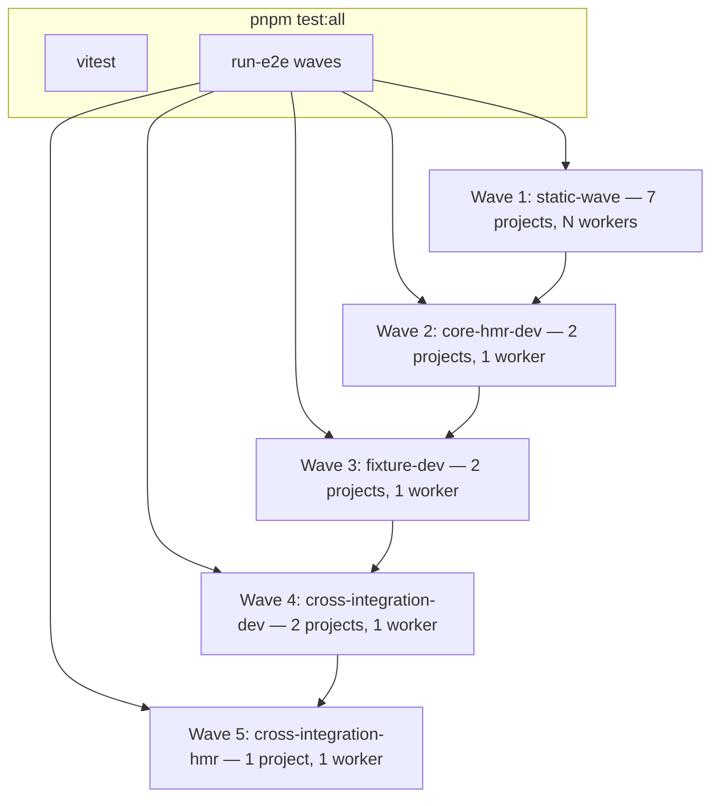

# E2E Test Plan

**Status:** Accepted  
**Last updated:** 2026-06-27

---

## Policy

1. **`pnpm test:all` is the only test gate.** Pre-commit, `prerelease`, and the publish workflow all invoke it. Change Playwright coverage in one place: `e2e/scripts/playwright/run-e2e.ts`.
2. **Cross-integration replaces the kitchen-sink host matrix.** Four canonical Playwright projects (bun/ecopages dev + preview + hmr, vite/node dev) cover the same behaviors without repeating every test on bun/node/vite×4 hosts.
3. **Rapid-navigation stays stressful.** Use `fireRapidLinkClicks` (overlapping navigations). Pacing every hop with full document waits stops testing SSR under load.
4. **Five sequential waves — one Playwright subprocess each.** Waves replace per-fixture batch groups and flat cross-integration batches. In-wave parallelism is handled by Playwright's per-project `workers` setting (`N` for static, `1` for dev/HMR).
5. **Preview vs dev is capability-based.** Tests move to preview only when static output can serve them. API handlers, middleware locals, WebSockets, and HMR stay on dev/HMR projects.

---

## Commands

| Command                          | Runs                                               |
| -------------------------------- | -------------------------------------------------- |
| `pnpm test:all`                  | `test:vitest` + full `test:e2e` (5 waves)          |
| `pnpm test:gate`                 | `test:vitest` + stress smoke (`--project cross-integration-dev-e2e --grep @stress`) |
| `pnpm test:vitest`               | Vitest `shared-core` + `browser`                   |
| `pnpm test:e2e`                  | All 5 waves sequentially                           |
| `pnpm test:e2e --project <name>` | Single project — debug only                        |
| `pnpm test:e2e:ui`               | Playwright UI mode                                 |

Pre-commit: `pnpm test:all`, then lint, lint-staged, typecheck.

---

## Playwright projects (14 total)

Defined in `playwright.config.ts` (composes self-describing capability fixtures + cross-integration), executed via 5 sequential waves in `run-e2e.ts`.

| Project                                | Fixture / app                             | In-project workers |
| -------------------------------------- | ----------------------------------------- | ------------------ |
| `core-hmr-dev-e2e`                     | `e2e/fixtures/core-hmr` (dev)             | **`1`**            |
| `core-hmr-postcss-dev-e2e`             | `e2e/fixtures/core-hmr` (dev + PostCSS)   | **`1`**            |
| `core-hmr-static-e2e`                  | `e2e/fixtures/core-hmr` (build+preview)   | `N`                |
| `browser-router-e2e`                   | `e2e/fixtures/browser-router` (preview)   | `N`                |
| `docs-e2e`                             | `@ecopages/docs`                          | `N`                |
| `react-router-e2e`                     | `e2e/fixtures/react-router` (preview)     | `N`                |
| `react-router-persist-layouts-e2e`     | same (preview, persist layouts)           | `N`                |
| `react-router-persist-layouts-dev-e2e` | same (dev, persist layouts)               | **`1`**            |
| `cache-e2e`                            | `e2e/fixtures/cache`                      | `N`                |
| `react-dev-e2e`                        | `playground/react`                        | `N`                |
| `cross-integration-preview-e2e`        | `playground/kitchen-sink` (preview)       | `N`                |
| `cross-integration-dev-e2e`            | `playground/kitchen-sink` (dev)           | **`1`**            |
| `cross-integration-hmr-e2e`            | `playground/kitchen-sink` (HMR)           | **`1`**            |
| `cross-integration-vite-dev-e2e`       | `playground/kitchen-sink` (vite dev)      | **`1`**            |

`N` = `os.availableParallelism()`. Wave definitions: [Orchestration waves](#orchestration-waves).

---

## Capability fixtures (`e2e/fixtures/*/fixture.e2e.ts`)

Each integration block gets a **focused fixture app** under `e2e/fixtures/<block>/` with a self-describing `fixture.e2e.ts` module. Root `playwright.config.ts` discovers these modules and composes their Playwright projects and web servers.

Register each fixture in `e2e/playwright/capability-fixture-registry.ts`. Wave coverage is guarded by `assertWaveCoverage()` in `e2e/playwright/orchestration-waves.ts` — adding a fixture without a wave fails loudly.

Test filename suffixes select the mode where applicable:

| Pattern                    | Runs on   |
| -------------------------- | --------- |
| `*.dev.test.e2e.ts`        | dev only  |
| `*.static.test.e2e.ts`     | static only |
| `*.postcss.dev.test.e2e.ts`| PostCSS dev only |
| `*.test.e2e.ts`            | per project `testMatch` / `testIgnore` |

### Block map

| Block              | Fixture dir                 | Status        |
| ------------------ | --------------------------- | ------------- |
| core-hmr           | `e2e/fixtures/core-hmr`     | **done**      |
| browser-router     | `e2e/fixtures/browser-router` | **done**    |
| react-router       | `e2e/fixtures/react-router` | **done**      |
| cache              | `e2e/fixtures/cache`        | **done**      |
| react              | `e2e/fixtures/react`        | **done**      |
| docs               | `e2e/fixtures/docs`         | **done**      |
| cross-integration  | `e2e/fixtures/cross-integration` | **done** (replaces kitchen-sink matrix) |
| css                | `e2e/fixtures/css`          | planned       |
| lit                | `e2e/fixtures/lit`          | planned       |
| images-mdx         | `e2e/fixtures/images-mdx`   | planned       |

---

## Orchestration waves (`run-e2e.ts`)

Five sequential waves — one Playwright subprocess each. Wave definitions live in `e2e/playwright/orchestration-waves.ts` (single source of truth). `assertWaveCoverage()` guards against drift: every registered project must appear in exactly one wave.

```text
Wave 1 — static-wave (7 projects, workers: N):
  browser-router-e2e, cache-e2e, core-hmr-static-e2e, docs-e2e,
  react-router-e2e, react-router-persist-layouts-e2e, cross-integration-preview-e2e

Wave 2 — core-hmr-dev (2 projects, workers: 1):
  core-hmr-dev-e2e, core-hmr-postcss-dev-e2e

Wave 3 — fixture-dev (2 projects, workers: 1):
  react-dev-e2e, react-router-persist-layouts-dev-e2e

Wave 4 — cross-integration-dev (2 projects, workers: 1):
  cross-integration-dev-e2e, cross-integration-vite-dev-e2e

Wave 5 — cross-integration-hmr (1 project, workers: 1):
  cross-integration-hmr-e2e
```

Waves run sequentially. In-wave parallelism is handled by Playwright's per-project `workers` setting. Cross-integration dev and vite-dev share one `.e2e-tmp/cross-integration-shared` workspace with scoped artifact dirs; HMR keeps an isolated copy because tests mutate source files.

Cleanup of `.e2e-tmp` runs **once** at the start of the first wave, not between waves.

### In-project workers (`playwright.config.ts`)

| Project group                                 | `workers` | Rationale                                                 |
| --------------------------------------------- | --------- | --------------------------------------------------------- |
| `core-hmr-dev-e2e`, `core-hmr-postcss-dev-e2e` | **`1`**   | Dev HMR mutates source files on disk                      |
| `core-hmr-static-e2e`                         | `N`       | Static build output                                       |
| `browser-router-e2e`, `docs-e2e`, `cache-e2e` | `N`       | Preview/static or low-contention servers                  |
| `react-router-*`, `react-dev-e2e`              | `N` or **`1`** | Static = `N`; dev = **`1`**                          |
| `cross-integration-preview-e2e`               | `N`       | Static build; no per-request SSR queue                    |
| `cross-integration-dev-e2e`, `cross-integration-vite-dev-e2e` | **`1`** | One shared dev server per project                   |
| `cross-integration-hmr-e2e`                   | **`1`**   | Serial describe; mutates shared source files on disk      |

### Verification (do not regress)

| Config                            | `cross-integration-dev-e2e` result                           |
| --------------------------------- | ------------------------------------------------------------ |
| `workers: N` (10 on this machine) | **15/22 failed** — SSR queue collapse, WS timeouts, `ENOENT` |
| `workers: 1`                      | **22/22 passed** (~3.2 min)                                  |
| `workers: N` on preview           | **17/17 passed** (~1.4 min)                                  |

**Rule:** Do not raise cross-integration dev/HMR in-project workers until dev SSR has a warm per-route cache (or each worker gets an isolated server + workspace). Raising static-wave or preview workers is always fine.

### What "max workers" means for `pnpm test:all`

```text
Vitest                          → shared-core + browser (vitest parallelism)
Wave 1 (static-wave)            → 1 Playwright process, N workers per project
Waves 2–5 (dev/hmr)             → 1 Playwright process each, 1 worker per project
```

### Do not

- Set cross-integration **dev** to `workers: N` to "speed up" — it overloads one SSR server.
- Call `cleanupE2eTempDir()` between waves.
- Use paced full reloads in rapid-navigation **stress** tests to compensate for dev slowness.
- Point multiple cross-integration projects at the same `.e2e-tmp` workspace directory (except dev + vite-dev, which share a read-only workspace by design).

### When to revisit

| Trigger                                                                                                      | Action                                                   |
| ------------------------------------------------------------------------------------------------------------ | -------------------------------------------------------- |
| Dev SSR route cache enabled for **dev** mode (`shouldPersistRouteModuleBuildCache` is production-only today) | Re-test dev workers at `N`                               |
| Per-test isolated cross-integration workspaces                                                               | Done — re-test HMR at `N` workers when dev cache lands   |
| Vite preview ports added                                                                                     | Add preview to static-wave; preview uses `N` workers     |

---

## Cross-integration inventory

**33 unique test cases** → **~34 Playwright executions** per full gate  
(19 dev on bun/ecopages + 1 vite-host dev + 2 hmr + 12 preview).

### Preview (`*.preview.test.e2e.ts`) — bun + node only

| File                                      | Tests | Notes                                                                                                                   |
| ----------------------------------------- | ----- | ----------------------------------------------------------------------------------------------------------------------- |
| `integration-matrix.preview.test.e2e.ts`  | 8     | One combined interactivity test per host entry (kita, react, lit, ecopages-jsx); SSR markup + hydration on static build |
| `preview-regressions.preview.test.e2e.ts` | 4     | JSX markers, CSS assets, vendor bundles, Lit SSR                                                                        |

Timeout: 60 s (project) · Workers: `availableParallelism()`

### Dev (`*.test.e2e.ts`, excluding HMR) — all four hosts

| File                                   | Tests | Notes                                                                                            |
| -------------------------------------- | ----- | ------------------------------------------------------------------------------------------------ |
| `api-lab.test.e2e.ts`                  | 2     | Browser rebind + `/api/v1/*` requests                                                            |
| `rapid-navigation.stress.test.e2e.ts`  | 3     | Full traversal + 2 cross-tech sequences; `@stress`; `fireRapidLinkClicks`                        |
| `rapid-navigation.content.test.e2e.ts` | 4     | Final-hop content assertions; `@content`; `recoverToPath` + `pollTestIdVisible` after rapid hops |
| `routes-and-shell.test.e2e.ts`         | 3     | Shell, explicit routes, catalog, 404 tour                                                        |
| `runtime-surfaces.test.e2e.ts`         | 3     | Middleware locals, images/transitions, PostCSS page                                              |
| `ws-chat.test.e2e.ts`                  | 7     | WebSocket UI + broadcast (per-worker room IDs)                                                   |

Timeout: 90 s (project) · Workers: `1`

### HMR (`includes-hmr.test.e2e.ts`) — all four hosts

| Tests | Notes                                                           |
| ----- | --------------------------------------------------------------- |
| 2     | Serial describe; mutates include + explicit-route files on disk |

Ready signals: `[ecopages] HMR Connected` (ecopages host) or `[vite] connected.` (vite host).  
Timeout: 90 s · Workers: `1`

### Timeouts in tests

Project defaults live in `playwright.config.ts`. Do not add per-test `test.setTimeout` overrides unless a single case needs more than the project default (e.g. `api-lab` rebind test uses 120 s).

---

## Cross-integration Playwright patterns

Tests use **plain Playwright** — no custom navigation framework. Shared helpers live in `playground/kitchen-sink/e2e/test-support.ts` and are re-exported from `helpers.ts`.

### Navigation

| Helper                            | Use                                                                                           |
| --------------------------------- | --------------------------------------------------------------------------------------------- |
| `gotoPath(page, href)`            | Resilient `page.goto` with retry on `net::ERR_ABORTED` (`waitUntil: 'commit'`)                |
| `recoverToPath(page, href)`       | After rapid in-app hops: wait for morph idle → `gotoPath` → wait idle again                   |
| `waitForNavigationIdle(page)`     | Poll `__ECO_PAGES__.navigation.hasPendingNavigationTransaction()` until false                 |
| `fireRapidLinkClicks(page, hops)` | Stress/content recovery — DOM clicks via `page.evaluate` (prefers `data-testid` on nav links) |

### Assertions

| Helper                                               | Use                                                                                                         |
| ---------------------------------------------------- | ----------------------------------------------------------------------------------------------------------- |
| `pollTestIdVisible(page, testId)`                    | Poll `page.evaluate` for `[data-testid]` visibility — avoids Playwright navigation-gate stalls during morph |
| `getPageTestId(href)` / `getPrimaryLinkTestId(href)` | Stable selectors from `src/data/primary-links.ts`                                                           |
| `trackRuntimeErrors(page)`                           | Capture page/console errors; call `assertClean()` at end of stress/content tests                            |
| `requestGetAndWait`                                  | Retry GET until 200 (preview warmup)                                                                        |

### Stress vs content

- **Stress (`@stress`):** `gotoPath` → `fireRapidLinkClicks` → `trackRuntimeErrors.assertClean()` — no content waits mid-sequence.
- **Content (`@content`):** rapid hops → `recoverToPath(finalHref)` → `pollTestIdVisible(getPageTestId(...))` (or `expect.poll` + `page.evaluate` for text).
- **Realtime (`@realtime`):** isolated room IDs per worker; ws-chat runs serial within its describe.

### `data-testid` hooks

Pages and shell expose `data-testid` where role/text selectors are unstable under morph (e.g. `kitchen-sink-shell`, `page-{route}`, `theme-toggle`, `data-chat-connected-username` on ws-chat status).

---

## Helpers (`playground/kitchen-sink/e2e/helpers.ts`)

Re-exports `counters.ts`, `layout.ts`, and `test-support.ts`. Import navigation/assertion helpers from `./test-support` or `./helpers`.

---

## Harness



**Isolated app:** `run-isolated-app.mjs` copies `playground/kitchen-sink` into `.e2e-tmp/<workspace>`, sets `ECOPAGES_CROSS_INTEGRATION_E2E` (Bun idle timeout), and scopes artifacts:

- `ECOPAGES_E2E_ARTIFACT_SCOPE` → `dist-${scope}` / `.eco-${scope}`
- Dev + vite-dev share one read-only workspace; HMR gets an isolated copy
- Copy excludes prior `dist-*` / `.eco-*` trees

---

## Preview vs dev placement

| Preview                                              | Dev / HMR                                                            |
| ---------------------------------------------------- | -------------------------------------------------------------------- |
| `integration-matrix` (static SSR + client hydration) | `routes-and-shell`, `runtime-surfaces` (middleware, explicit routes) |
| `preview-regressions`                                | `api-lab` (live `/api/v1/*`)                                         |
|                                                      | `rapid-navigation`, `ws-chat`, `includes-hmr`                        |

**Cannot move to preview** (returns HTML or lacks request scope): API routes, middleware locals, WebSockets.

**Vite hosts:** integration-matrix runs on bun/node preview only until vite preview projects exist.

**Do not** point multiple cross-integration projects at the same workspace directory (except dev + vite-dev sharing a read-only workspace).

---

## Stability constraints (do not regress)

| Change                                           | Observed result                                                                       |
| ------------------------------------------------ | ------------------------------------------------------------------------------------- |
| `workers: N` on cross-integration dev            | 15/22 failed (SSR overload)                                                           |
| `workers: 1` on cross-integration dev            | 22/22 passed                                                                          |
| Multiple dev servers without workspace isolation | `ENOENT` on `.tmp.js`, HMR timeouts                                                   |
| Paced clicks in rapid-navigation stress          | ~90 s+ traversal; stops testing overlap                                               |
| Playwright locator assertions during morph       | "waiting for navigation to finish" — use `pollTestIdVisible` or `page.evaluate` polls |

---

## Wall-clock (rough)

Capture timings with `ECOPAGES_E2E_TIMING=true pnpm test:e2e`. Lines prefixed `[e2e-timing]` report per-wave durations. Re-run after orchestration changes to verify regressions.

| Scope                      | Target       | Notes                                                  |
| -------------------------- | ------------ | ------------------------------------------------------ |
| Vitest                     | ~1–3 min     |                                                        |
| Static wave (7 projects)   | ~5–10 min    | N workers per project; docs build skip when dist fresh |
| Dev waves (waves 2–5)      | ~5–10 min    | 1 worker per project; sequential waves                 |
| **Full `test:all`**        | **< 20 min** | Vitest + 5 waves                                       |
| Stress smoke (`test:gate`) | < 5 min      | Vitest + 1 project stress subset                       |

Empirical dev-worker ceiling (do not regress): `workers: N` on cross-integration dev → **15/22 failed**; `workers: 1` → **22/22 passed**.

---

## Debug shortcuts

Not substitutes for `test:all`. Full env-var reference: [`e2e/README.md`](../e2e/README.md).

| Shortcut                                                        | Effect                                           |
| --------------------------------------------------------------- | ------------------------------------------------ |
| `pnpm test:e2e --project <name>`                                | One Playwright project — bypasses waves          |
| `pnpm test:e2e --grep @stress`                                  | Filter by behavior tag (passes through to PW)    |
| `pnpm test:e2e:ui`                                              | Interactive mode                                 |
| `ECOPAGES_E2E_TIMING=true pnpm test:e2e`                        | Full gate with `[e2e-timing]` per-wave logs      |
| `ECOPAGES_REUSE_TEST_SERVERS=true pnpm test:e2e --project <name>` | Reuse already-running servers                  |

---

## Failure triage

| Symptom                                       | Likely cause                                                                                  |
| --------------------------------------------- | --------------------------------------------------------------------------------------------- |
| "browser has been closed" cascade             | One test hit the project timeout                                                              |
| `ENOENT` on `.tmp.js`                         | Too many dev workers or multiple cross-integration servers at once                           |
| HMR connect timeout                           | Server not ready; verify single-project wave                                                  |
| Preview API returns HTML                      | Test belongs on dev, not `*.preview.test.e2e.ts`                                              |
| Slow rapid-navigation                         | Accidentally awaiting content on every stress hop                                             |
| "waiting for navigation to finish" on locator | In-flight browser-router morph — use `recoverToPath`, `pollTestIdVisible`, or `page.evaluate` |

---

## Summary

`pnpm test:all` = Vitest + 14 Playwright projects in 5 sequential waves. Static-wave runs with `N` workers per project; dev/HMR waves run with `1` worker. See [Orchestration waves](#orchestration-waves-run-e2ets).
