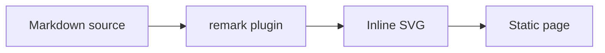
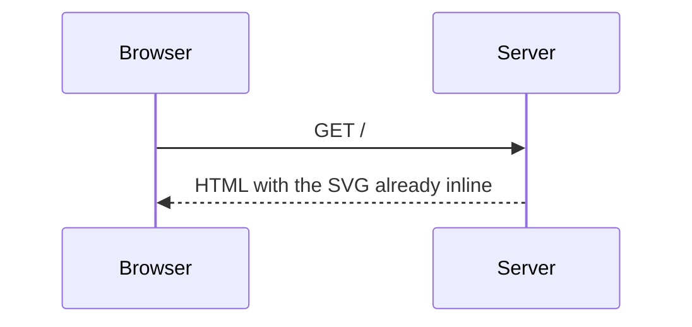

# Diagrams

A flowchart:

```mermaid
flowchart LR
  Source[Markdown source] --> Plugin[remark plugin]
  Plugin --> Svg[Inline SVG]
  Svg --> Page[Static page]
```

A sequence diagram:

```mermaid
sequenceDiagram
  Browser->>Server: GET /
  Server-->>Browser: HTML with the SVG already inline
```
