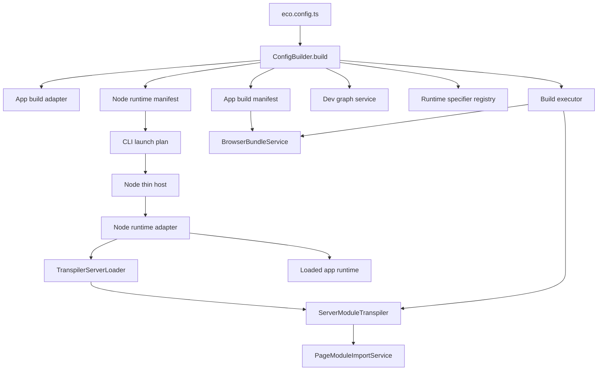
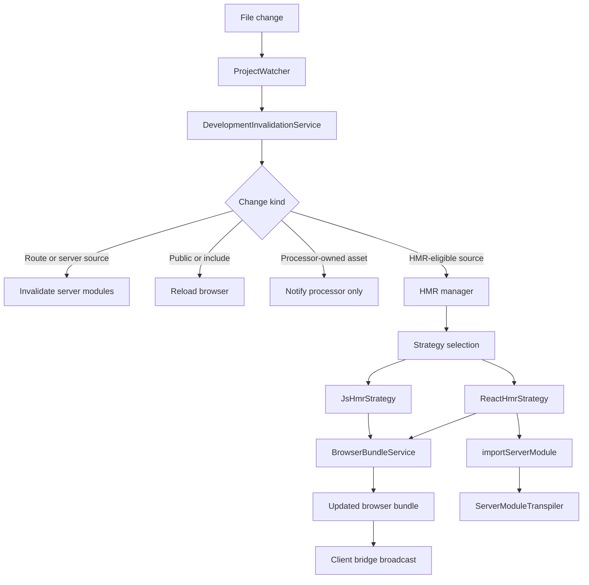

# @ecopages/core

The foundational engine for the Ecopages framework. It provides the core build pipeline, development server, routing, and plugin architecture required to run an Ecopages application.

## Overview

Ecopages is an extensible static site generator (SSG) built for universal execution across Bun and Node.js. It embraces a strictly MPA (Multi-Page Application) architecture by default, rendering HTML at build-time or request-time, and hydrating interactive islands only where necessary.

- **Universal Support**: First-class, optimized execution on both **Bun** and **Node.js** runtimes, powered by a unified `createApp` factory.
- **Fast by default**: Uses native ESM, optimized file watching, and esbuild for high-performance bundling and server-side rendering.
- **Framework agnostic**: First-class support for KitaJS, Lit, React, and MDX via official integration plugins.
- **Extensible**: Hook into the build process with custom processors or rendering integrations.

## Current Architecture

The current core package is organized around app-owned runtime state and explicit service boundaries.

The important ownership rules are:

- `ConfigBuilder.build()` finalizes app-owned build and runtime services.
- browser bundling and server module loading are explicit, separate paths.
- runtime hosts stay thin and delegate framework work into core services.
- HMR and invalidation use shared graph-aware services instead of runtime-specific ad hoc wiring.

### Bootstrap And Runtime Ownership



### Development Invalidation And HMR Flow



### Practical Summary

- `ConfigBuilder` now seeds one app-owned build adapter, manifest, executor, dev graph, and runtime registry.
- `BrowserBundleService` is the shared browser build seam used by HMR and asset-oriented browser output paths.
- `ServerModuleTranspiler` is the shared server-side source loading seam used by runtime bootstrap and HMR metadata loading.
- the Node thin-host path exists to keep startup framework-owned without putting source parsing or tsconfig ownership into the host itself.

## Documentation Map

Use this package README as the top-level map, then drill into the focused subsystem READMEs:

- `src/config/README.md`: config finalization and app-owned runtime/build state
- `src/plugins/README.md`: integration and processor authoring contracts
- `src/build/README.md`: build adapter, executor, and development build coordination
- `src/services/README.md`: cross-cutting runtime services and orchestration helpers
- `src/adapters/README.md`: Bun, Node, and shared adapter boundaries
- `src/hmr/README.md`: HMR strategy and update-layer ownership
- `src/router/README.md`: route discovery, matching, and browser navigation coordination
- `src/route-renderer/README.md`: rendering orchestration and dependency resolution
- `src/static-site-generator/README.md`: static build execution path
- `src/eco/README.md`: `eco` authoring APIs for pages, layouts, and components

The intended reading order is:

1. this file for the big-picture architecture
2. `src/config/README.md` for config and lifecycle ownership
3. `src/plugins/README.md` and `src/build/README.md` for contribution contracts
4. `src/services/README.md` and `src/adapters/README.md` for runtime execution
5. `src/router/README.md` and `src/route-renderer/README.md` for request-time flow

## Installation

```bash
bunx jsr add @ecopages/core
```

_(You can also use `npm`, `yarn`, or `pnpm`)_

## Basic Usage

The Ecopages architecture revolves around an `eco.config.ts` file and an application entry point.

### 1. Configuration (`eco.config.ts`)

Configure your integratons, processors, and default metadata. Ecopages uses a builder pattern:

```typescript
import { ConfigBuilder } from '@ecopages/core/config-builder';
// import your desired plugins...

const config = await new ConfigBuilder()
	.setRootDir(import.meta.dirname)
	.setBaseUrl(import.meta.env.ECOPAGES_BASE_URL ?? 'http://localhost:3000')
	.setDefaultMetadata({
		title: 'My Ecopages Site',
		description: 'Built with Ecopages',
	})
	// .setIntegrations([kitajsPlugin()])
	.build();

export default config;
```

### 2. Application Entry (`app.ts`)

Start the application using the universal `createApp` factory. It automatically detects your runtime and applies the correct adapter.

```typescript
import { createApp } from '@ecopages/core';
import appConfig from './eco.config';

const app = createApp({ appConfig });

await app.start();
```

### 3. Creating Pages

Use the `eco.page()` factory to define static routes. Place these in `src/pages/`:

```tsx
import { eco } from '@ecopages/core';
import { BaseLayout } from '@/layouts/base-layout';

export default eco.page({
	layout: BaseLayout,
	metadata: () => ({
		title: 'Home',
	}),
	render: () => (
		<div>
			<h1>Welcome to Ecopages</h1>
		</div>
	),
});
```

### 4. Reusable Components

Define components with `eco.component()` to automatically inject necessary stylesheets or scripts only when that component is rendered:

```tsx
import { eco } from '@ecopages/core';

export const MyButton = eco.component({
	dependencies: {
		stylesheets: ['./button.css'],
	},
	render: ({ label }) => <button className="my-button">{label}</button>,
});
```

### 5. API Handlers

Add server-side routes using `defineApiHandler`. Register them on your `app` instance before starting:

```typescript
import { defineApiHandler } from '@ecopages/core';

export const helloWorld = defineApiHandler({
	path: '/api/hello',
	method: 'GET',
	handler: async ({ response }) => {
		return response.json({ message: 'Hello World' });
	},
});
```

Attach the handler in your `app.ts` entry:

```typescript
// app.ts
import { createApp } from '@ecopages/core';
import { helloWorld } from './handlers/hello';
import appConfig from './eco.config';

const app = createApp({ appConfig });

app.get(helloWorld); // Register the API handler

await app.start();
```

See the [official documentation](https://ecopages.app) for advanced usage, API handlers, and integrations.

## Import Structure

Use the root package exports for standard authoring. The framework automatically detects your runtime and uses the optimal internal adapter:

```ts
import { createApp, defineApiHandler, defineGroupHandler, eco } from '@ecopages/core';
```

> [!NOTE]
> `createApp` is now the recommended universal entrypoint over `EcopagesApp`.

### Runtime Escape Hatches

Use runtime-specific subpaths only when you explicitly need Bun-native or Node-native APIs that bypass the universal abstractions:

- `@ecopages/core/bun`
- `@ecopages/core/node`
