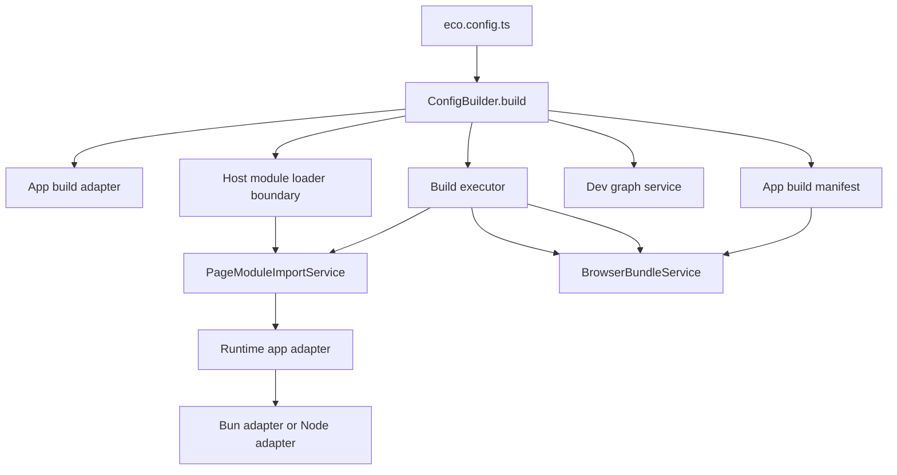
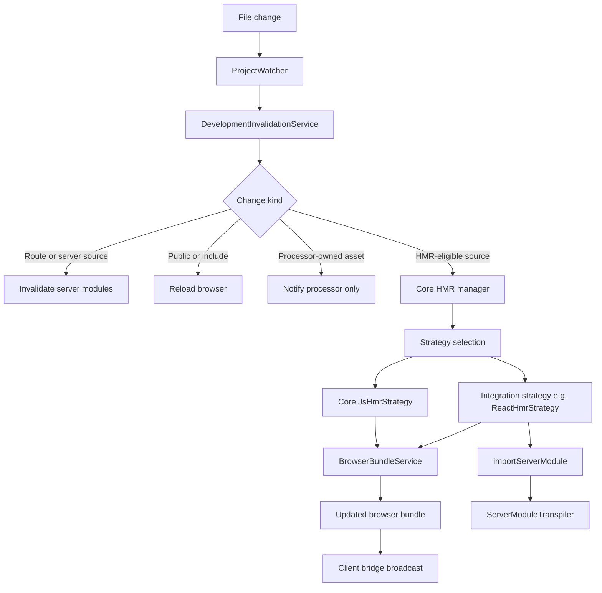

# @ecopages/core

The foundational engine for the Ecopages framework. It provides the core build pipeline, development server, routing, and plugin architecture required to run an Ecopages application.

## Overview

Ecopages is an extensible static site generator (SSG) built around a Bun-first core with Node fallback support and Vite-hosted compatibility for advanced dev and build orchestration. It embraces a strictly MPA (Multi-Page Application) architecture by default, rendering HTML at build-time or request-time, and hydrating interactive islands only where necessary.

- **Runtime Boundary**: `createApp()` prefers Bun when available and falls back to Node otherwise. Vite and Nitro still own host-side dev and build orchestration.
- **Build Ownership**: Bun-native execution keeps a core-owned build path. Vite and Nitro own host-side transforms, module graph behavior, and deployment-oriented builds.
- **Framework agnostic**: First-class support for KitaJS, Lit, React, and MDX via official integration plugins.
- **Extensible**: Hook into the build process with custom processors or rendering integrations.

## Current Architecture

Projects load shared ambient types through `@ecopages/core/declarations`. This entry references `src/css-imports.d.ts`, which keeps the wildcard CSS declaration in a standalone ambient file so side-effect CSS imports typecheck without per-project declarations.

The current core package is organized around app-owned runtime state and explicit service boundaries.

The important ownership rules are:

- `ConfigBuilder.build()` finalizes app-owned build and runtime services.
- Component identity attribution is one shared source transform for server, browser, and HMR compilation paths: after a lexical `eco.` gate, it uses Oxc to wrap supported factory options with `bindComponentIdentity()`, which factories retain as `config.identity`.
- Direct local Eco Component imports (including named `export { X } from` barrels) and relative side-effect CSS imports supply Dependencies by default through the shared transform and existing collector; explicit asset declarations override inference, and inferred styles stay keyed by identity until collection. See [eco](src/eco/README.md) and [Plugin Contracts](src/plugins/README.md).
- Browser bundling and server module loading are separate paths. SSR-enabled lazy scripts execute on the server before rendering and in the browser only on their configured trigger.
- runtime hosts stay thin and delegate framework work into core services.
- HMR and invalidation use shared graph-aware services instead of runtime-specific ad hoc wiring.

### Bootstrap And Runtime Ownership


```mermaid
flowchart TD
	A[eco.config.ts] --> B[ConfigBuilder.build]
	B --> C[App build adapter]
	B --> D[App build manifest]
	B --> E[Build executor]
	B --> F[Dev graph service]
	B --> G[Host module loader boundary]
	G --> H[PageModuleImportService]
	E --> H
	E --> I
	E --> I[BrowserBundleService]
	H --> J[Runtime app adapter]
	J --> K[Bun adapter or Node adapter]
	D --> I
```

### Development Invalidation And HMR Flow


```mermaid
flowchart TD
	A[File change] --> B[ProjectWatcher]
	B --> C[DevelopmentInvalidationService]
	C --> D{Change kind}
	D -->|Route or server source| E[Invalidate server modules]
	D -->|Public or include| F[Reload browser]
	D -->|Processor-owned asset| G[Notify processor only]
	D -->|HMR-eligible source| H[Core HMR manager]
	H --> I[Strategy selection]
	I --> J[Core JsHmrStrategy]
	I --> K[Integration strategy e.g. ReactHmrStrategy]
	J --> L[BrowserBundleService]
	K --> L
	K --> M[importServerModule]
	M --> N[ServerModuleTranspiler]
	L --> O[Updated browser bundle]
	O --> P[Client bridge broadcast]
```

The manager/orchestration layer is core-owned, but framework-specific strategies such as React HMR are contributed by integrations and registered with the shared HMR manager.

### Practical Summary

- `ConfigBuilder` seeds one app-owned build ownership path, adapter, manifest, executor, dev graph, and runtime registry.
- `BrowserBundleService` is the shared browser build seam used by HMR and asset-oriented browser output paths.
- `ServerModuleTranspiler` is the shared server-side source loading seam used by runtime bootstrap and HMR metadata loading.
- `createApp()` stays the universal runtime entrypoint, while Vite and Nitro hosts own their advanced dev and build workflows.
- One bundled adapter is the default bundler. Vite-based apps route through the `ViteHostBuildAdapter` boundary marker instead.

## Documentation Map

Use this package README as the top-level map, then drill into the focused subsystem READMEs:

- `src/config/README.md`: config finalization and app-owned runtime/build state
- `src/plugins/README.md`: integration and processor authoring contracts
- `src/build/README.md`: build adapter, executor, development build coordination, and standalone Node server packaging
- `src/services/README.md`: cross-cutting runtime services and orchestration helpers
- `src/adapters/README.md`: Bun, Node, and shared adapter boundaries
- `src/dev/README.md`: dev transform server, on-demand client delivery, and invalidation during compilation
- `src/hmr/README.md`: HMR strategy and update-layer ownership
- `src/router/README.md`: route discovery, matching, and browser navigation coordination
- `src/route-renderer/README.md`: rendering orchestration and dependency resolution
- `src/static-site-generator/README.md`: static build execution path
- `src/eco/README.md`: `eco` authoring APIs for pages, layouts, and components

The intended reading order is:

1. this file for the big-picture architecture
2. `src/config/README.md` for config and lifecycle ownership
3. `src/plugins/README.md` and `src/build/README.md` for contribution contracts
4. `src/services/README.md` and `src/adapters/README.md` for runtime execution
5. `src/router/README.md` and `src/route-renderer/README.md` for request-time flow

## Installation

```bash
bun add @ecopages/core
```

_(You can also use `npm`, `yarn`, or `pnpm`)_

## Basic Usage

The Ecopages architecture revolves around an `eco.config.ts` file and an application entry point.

### 1. Configuration (`eco.config.ts`)

Configure your integratons, processors, and default metadata. Ecopages uses a builder pattern:

```typescript
import { ConfigBuilder } from '@ecopages/core/config-builder';
import { ecopagesJsxPlugin } from '@ecopages/ecopages-jsx';

const config = await new ConfigBuilder()
	.setRootDir(import.meta.dirname)
	.setBaseUrl(import.meta.env.ECOPAGES_BASE_URL ?? 'http://localhost:3000')
	.setDefaultMetadata({
		title: 'My Ecopages Site',
		description: 'Built with Ecopages',
	})
	.setIntegrations([ecopagesJsxPlugin()])
	.build();

export default config;
```

### 2. Application Entry (`app.ts`)

Start the application using `createApp`. It will choose the Bun adapter when Bun is available and fall back to Node otherwise.

```typescript
import { createApp } from '@ecopages/core/create-app';
import appConfig from './eco.config';

const app = await createApp({ appConfig });

await app.start();
```

### 3. Creating Pages

Use the `eco.page()` factory to define static routes. Place these in `src/pages/`:

```tsx
import { eco } from '@ecopages/core';
import { BaseLayout } from '@/layouts/base-layout';

export default eco.page({
	layout: BaseLayout,
	metadata: () => ({
		title: 'Home',
	}),
	render: () => (
		<div>
			<h1>Welcome to Ecopages</h1>
		</div>
	),
});
```

### 4. Reusable Components

Define components with `eco.component()` to automatically inject necessary stylesheets or scripts only when that component is rendered:

```tsx
import { eco } from '@ecopages/core';

export const MyButton = eco.component({
	dependencies: {
		stylesheets: ['./button.css'],
	},
	render: ({ label }) => <button className="my-button">{label}</button>,
});
```

Dependency ownership affects final asset packaging:

- Stylesheets and scripts declared from `eco.html()` stay Html-owned and can be emitted as shared app-wide assets.
- Stylesheets and scripts declared from Pages, Layouts, or Components are resolved into page-owned assets for the rendered route.
- This split is intentional. Shared Html assets can be cached across routes, while page-owned assets can change without invalidating the global shell.

### 5. API Handlers

Add server-side routes using `defineApiHandler` or the method helpers (`defineGet`, `definePost`, …). Register them on your `app` instance before starting:

```typescript
import { defineApiHandler, defineGet, json } from '@ecopages/core';

export const helloWorld = defineGet({
	path: '/api/hello',
	handler: async ({ response }) => {
		return response.json({ message: 'Hello World' });
	},
});

// Equivalent with an explicit method:
export const helloWorldAlt = defineApiHandler({
	path: '/api/hello',
	method: 'GET',
	handler: async () => json({ message: 'Hello World' }),
});
```

Group related routes with `defineGroupHandler`. Prefer `api.get` / `api.post` helpers inside the `routes` callback:

```typescript
import { defineGroupHandler } from '@ecopages/core';

export const adminGroup = defineGroupHandler({
	prefix: '/admin',
	routes: (api) => [
		api.get({
			path: '/',
			handler: async ({ response }) => response.json({ ok: true }),
		}),
		api.post({
			path: '/items',
			handler: async ({ response }) => response.status(201).json({ created: true }),
		}),
	],
});
```

Standalone response helpers (`json`, `html`, `redirect`) share the same body emission path as `context.response.json()` / `context.response.html()`.

Register a prebuilt handler with `app.add()`. Use `app.get(path, handler)` only when defining the route inline in `app.ts`.

Attach the handler in your `app.ts` entry:

```typescript
import { createApp } from '@ecopages/core/create-app';
import { helloWorld } from './handlers/hello';
import appConfig from './eco.config';

const app = await createApp({ appConfig });

app.add(helloWorld);

await app.start();
```

See the [official documentation](https://ecopages.app) for advanced usage, API handlers, and integrations.

## Import Structure

Use the `create-app` subpath for runtime startup and the root package for standard authoring helpers:

```ts
import { createApp } from '@ecopages/core/create-app';
import { defineApiHandler, defineGet, defineGroupHandler, eco } from '@ecopages/core';
```

> [!NOTE]
> Use `createApp()` from `@ecopages/core/create-app` as the application entrypoint.

### Runtime Escape Hatches

Use runtime-specific subpaths only when you explicitly need Bun-native APIs that bypass the universal abstractions:

- `@ecopages/core/bun`

## Entry Point Roles

The published subpaths are grouped by architectural role rather than by source folder.

### App Authoring

Use these entrypoints when building an Ecopages app:

- `@ecopages/core`
- `@ecopages/core/create-app`
- `@ecopages/core/config-builder`
- `@ecopages/core/errors`
- `@ecopages/core/hash`
- `@ecopages/core/declarations`
- `@ecopages/core/env`
- `@ecopages/core/bun`

### Browser Navigation

Use these entrypoints when a browser runtime needs to coordinate document ownership and link intent:

- `@ecopages/core/router/navigation-coordinator`
- `@ecopages/core/router/link-intent`

### Extension Authoring

Use these entrypoints when implementing integrations, processors, or source transforms:

- `@ecopages/core/plugins/integration-plugin`
- `@ecopages/core/plugins/processor`
- `@ecopages/core/plugins/source-transform`
- `@ecopages/core/route-renderer/orchestration/integration-renderer`
- `@ecopages/core/route-renderer/orchestration/document-shell/layout-shell-props.service`
- `@ecopages/core/services/asset-processing-service`
- `@ecopages/core/hmr/hmr-strategy`

### Host And Runtime Composition

Use these entrypoints only when implementing host adapters or framework-owned bundling seams:

- `@ecopages/core/dev/host-runtime`
- `@ecopages/core/build/build-adapter`
- `@ecopages/core/build/build-types`
- `@ecopages/core/plugins/foreign-jsx-override-plugin`

These host-facing entrypoints are narrower compatibility seams. App code and most extensions should prefer the app-authoring or extension-authoring surfaces.
