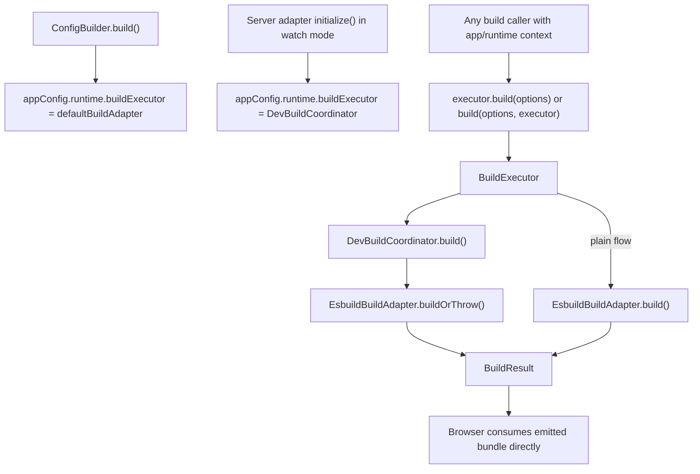

# Build Layer

This directory contains the runtime-neutral build contract used across Ecopages and the esbuild-backed implementation that currently powers the shared default adapter.

## Files

- `build-adapter.ts`: shared build interfaces, result types, the exported `defaultBuildAdapter` singleton, and the top-level `build()` / `getTranspileOptions()` pipeline functions.
- `build-types.ts`: plugin bridge types used by integrations and processors.
- `esbuild-build-adapter.ts`: the concrete esbuild backend.
- `dev-build-coordinator.ts`: development-only orchestration around the shared esbuild backend.
- `*.test.ts`: focused regression coverage for plain builds and development serialization and recovery.

## Responsibilities

The build layer is intentionally split into two parts.

`BuildExecutor` is the runtime-facing contract.

- It is the narrow facade stored on `appConfig.runtime.buildExecutor`.
- It answers only how a given app instance should execute builds right now.
- `EsbuildBuildAdapter` satisfies this contract directly in plain flows.
- `DevBuildCoordinator` also satisfies this contract by wrapping the shared esbuild adapter with development-only serialization and recovery policy.

`EsbuildBuildAdapter` is the backend. It knows how to:

- load the esbuild module
- translate Ecopages `BuildOptions` into esbuild options
- bridge Ecopages build plugins into esbuild hooks
- normalize build output, logs, and dependency graph metadata
- detect the subset of runtime faults that mean the esbuild worker protocol is corrupted

`DevBuildCoordinator` is the development policy layer. It exists because one app/runtime can have many build callers during dev mode, including:

- page module imports
- HMR entrypoint builds
- script and asset processors
- React integration build paths

Those callers must not race each other against one long-lived esbuild worker. The coordinator therefore owns:

- serialized access to the shared adapter in development
- recycling warm Node-target esbuild sessions between builds
- recovery from known esbuild worker protocol faults

## Default Flow

Each `EcoPagesAppConfig` owns a `buildExecutor` in `appConfig.runtime`. The config builder initializes that executor to the plain shared adapter by default.

When a Node or Bun server adapter starts in watch mode, it replaces that executor with a per-app `DevBuildCoordinator`. Build consumers then either call the executor directly or pass it explicitly to the top-level `build()` helper.

HMR callers follow the same ownership model. Integration-specific runtime aliasing stays with the integration that owns those specifiers, rather than in generic core HMR bundling.

## Orchestration Diagram

## Recovery Model

The recovery path is narrow on purpose. The coordinator only treats an error as recoverable when `EsbuildBuildAdapter.isEsbuildProtocolError()` matches one of the known worker-protocol failure signatures.

When that happens, recovery does three things in order:

1. Reset the serialized queue so future builds are not stuck behind a wedged promise.
2. Stop the current esbuild service instance.
3. Increment the esbuild module generation so the next import gets a fresh worker instance.

After that reset, the coordinator retries the failed build once.

## Why Explicit App Ownership

There are many build callsites across core and integrations. The coordinator still needs to stay centralized, but process-global installation hid the real dependency and tied behavior to startup order.

The explicit app-owned executor model keeps the design honest:

- each app/runtime owns its own build executor
- development policy stays in one place (`DevBuildCoordinator`)
- callers with app context use that executor explicitly instead of consulting global state
- tests can still instantiate `EsbuildBuildAdapter` or `DevBuildCoordinator` directly when they want the raw backend only

## Testing Strategy

The build tests are split by concern.

- `build-adapter.test.ts` verifies plain backend behavior and plugin bridging.
- `build-adapter-serialization.test.ts` verifies development orchestration behavior such as serialization, warm-session recycling, and protocol-fault recovery.

If you change the build orchestration rules, update the coordinator tests first. If you change esbuild option mapping or plugin behavior, update the backend tests first.
