# Rendering Logic Graph

This document maps the end-to-end rendering logic in core, including request-time rendering, explicit route rendering, static generation, and deferred boundary orchestration.

## Design Principles

These diagrams are based on a few architectural assumptions that seem important to preserve:

- **Rendering entry points are separate, but should converge on shared renderer contracts.**
  Request-time page rendering, explicit view rendering, and static generation all eventually depend on the same integration renderer behavior.
- **Integration choice should remain a boundary concern.**
  Adapters and route matchers decide which renderer to use; once selected, the integration renderer owns the page render pipeline.
- **Data resolution should happen before HTML transformation.**
  Static props, metadata, dependency processing, and route assets are all upstream of final HTML injection.
- **Deferred boundary orchestration should stay renderer-owned.**
  The initial integration render is responsible for handing foreign boundaries back to their owning renderer before final route HTML is returned.
- **Foreign boundary ownership is renderer-defined behavior.**
  If a renderer cannot resolve a foreign boundary inside its own runtime, route execution now treats any leftover unresolved boundary artifact HTML as an error instead of attempting any route-level fallback.
- **Caching policy is authoritative at the page layer.**
  Middleware, locals, and response reuse all depend on the effective page cache strategy.
- **Asset emission should converge into one injection stage.**
  Route-level assets, integration assets, page-root component assets, and renderer-owned boundary assets all end up in the HTML transformer.

## Entry Points

There are three main rendering entry points:

1. **Runtime request rendering**
    - handled through the server adapters and file-system route matching
2. **Explicit rendering APIs**
    - handled through `renderToResponse()` and route-handler render context helpers
3. **Static site generation**
    - handled through explicit route generation and route renderer reuse at build time

## 1) Runtime Request Flow (Bun and Node)

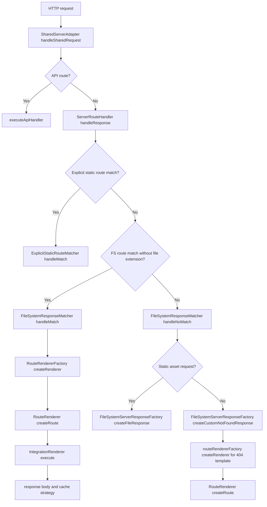

## 2) FS Route Rendering + Middleware + Cache

This is the most operationally important runtime path because it is where middleware, locals, and cache behavior are coordinated.

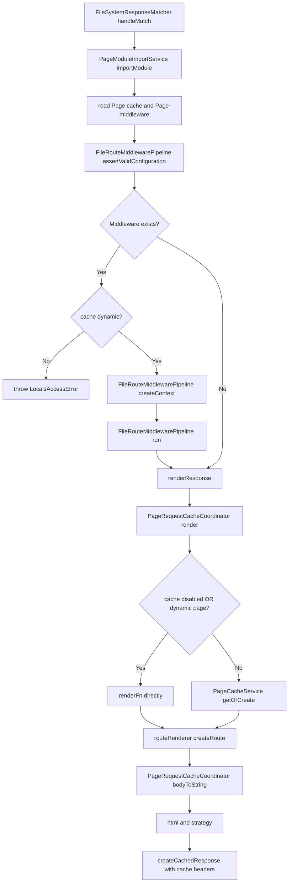

## 3) RouteRendererFactory Selection Logic

This is a small but important boundary. It centralizes integration selection and renderer reuse, which helps keep adapter code thin.

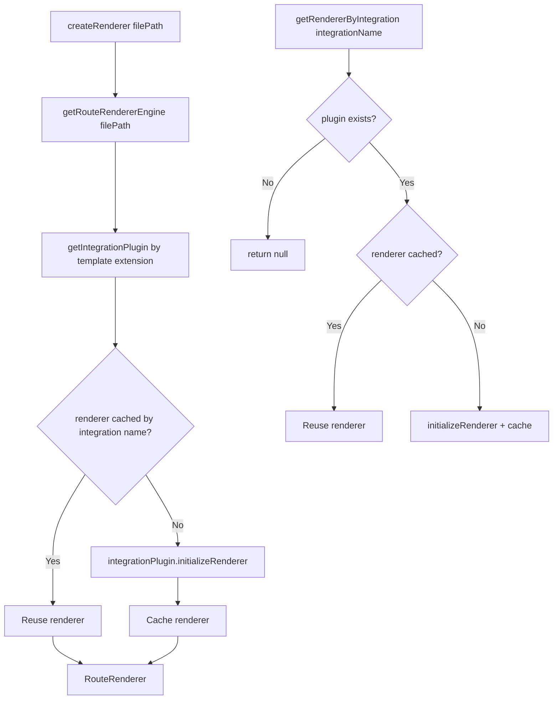

## 4) IntegrationRenderer Pipeline

The original single graph was accurate but a bit dense. Splitting it into preparation and execution phases makes the orchestration easier to reason about.

### 4.1 Render preparation via `RenderPreparationService`

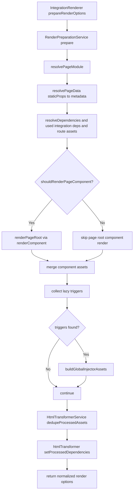

### 4.2 Main execute flow via `RenderExecutionService`

Important nuance: this phase does not resolve mixed-integration boundaries itself anymore. Renderer-owned runtimes must finish that work before route finalization. If unresolved boundary artifact HTML survives to this phase, route execution fails fast.

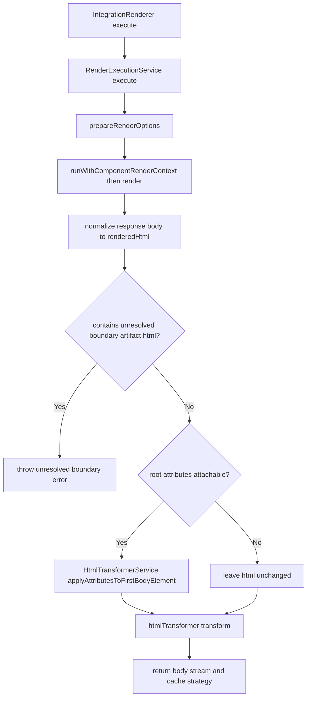

### 4.3 Render preparation responsibilities

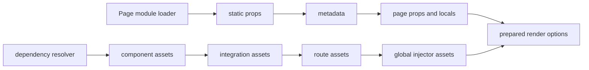

### 4.4 Service boundary map

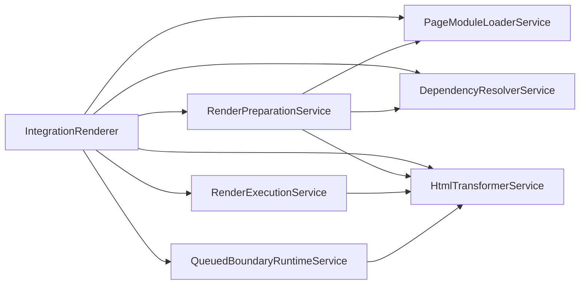

## 5) Boundary Tokens And Renderer-Owned Resolution

This part is architecturally interesting because boundaries can still emit temporary transport tokens, but renderer-owned runtimes are now responsible for resolving foreign descendants before final route HTML is returned.

If this feels complex, the simplest mental model is:

- first pass: render everything that can be rendered safely right now
- when a renderer supports mixed boundaries, hand foreign descendants back to the owning renderer inside that renderer's runtime
- if literal `<eco-marker>` boundary artifact HTML survives to route finalization, treat it as a failure instead of attempting any route-level fallback
- final pass: merge emitted assets and perform the normal HTML transformation

In the current implementation, renderer-owned runtimes use internal boundary tokens for queued nested handoff. Literal `<eco-marker>` markup remains only as a route-level failure signal when unresolved boundary artifacts escape renderer-owned resolution.

Important clarification: not every integration automatically goes through this stage. Boundary queueing is conditional.

- If a render pass stays inside one integration, rendering continues directly to post-processing and HTML transformation.
- If a renderer can resolve foreign descendants inline, the boundary runtime returns resolved HTML immediately.
- If a renderer needs token-based nested handoff, it queues renderer-owned transport tokens and resolves them before returning final HTML.

### Why this exists

Renderer-owned boundary queueing exists because some component boundaries cannot always be rendered eagerly inside the current integration pass.

Typical reasons include:

- the child component belongs to a different integration/runtime
- the child integration needs its own renderer entry point
- the parent render needs to preserve ordering and slots before the child subtree is resolved
- the child render may emit its own assets or root attributes that must be merged back into the final document

So the first pass either returns resolved renderer-owned output immediately or emits a renderer-local transport token that is resolved before the enclosing renderer returns its final HTML.

Another way to say it:

- a boundary token says "this subtree belongs to another renderer, but the current renderer still owns the overall render pass"
- the token stores just enough information to make that later renderer-owned handoff deterministic
- the queue exists so nested foreign boundaries resolve from leaves to parents while preserving child insertion order and emitted assets

### 5.1 Boundary interception in `eco.component` factory

The key rule here today is: boundaries are resolved by the owning renderer, not by a shared core fallback. During an active component render pass, `eco.component` asks the current render boundary context whether the next boundary should render inline or be resolved by a foreign renderer runtime.

For the current built-in integrations, this is how non-owning renderers hand foreign subtrees back to the owning runtime without relying on a shared core fallback.

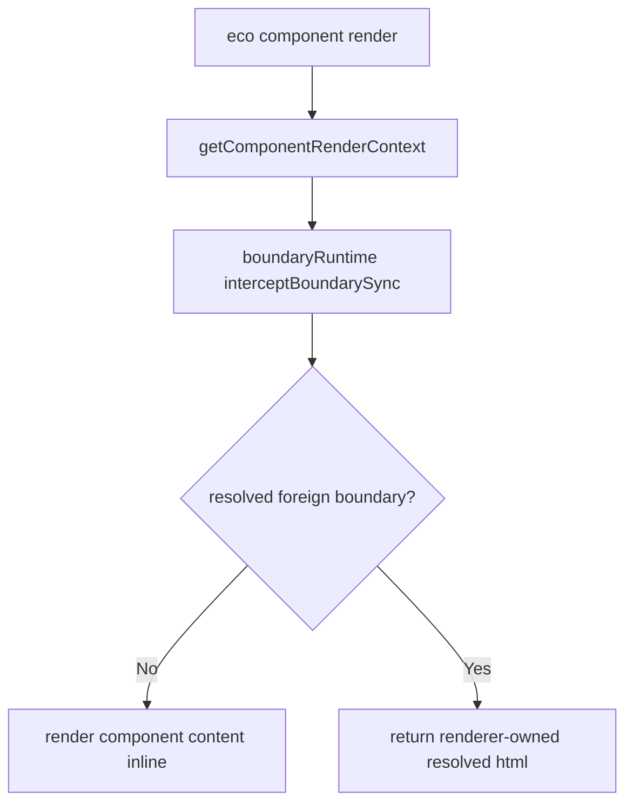

### 5.2 Queued boundary execution

When string-first renderers queue foreign boundaries, the base renderer helper resolves queued boundary tokens directly against the shared queue service. That pass is intentionally narrow: it only resolves queued boundary tokens that the owning renderer emitted as transport artifacts for that string runtime.

This means boundary tokens are no longer a general component-boundary contract. Core only resolves queued boundary payloads that already belong to a renderer-owned string boundary workflow.

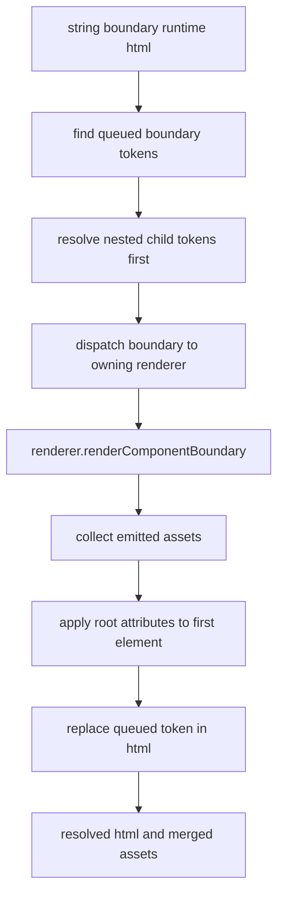

## 6) Explicit Rendering Paths (outside FS page matching)

These paths are simpler than request-time file-system rendering because they bypass most router and cache orchestration.

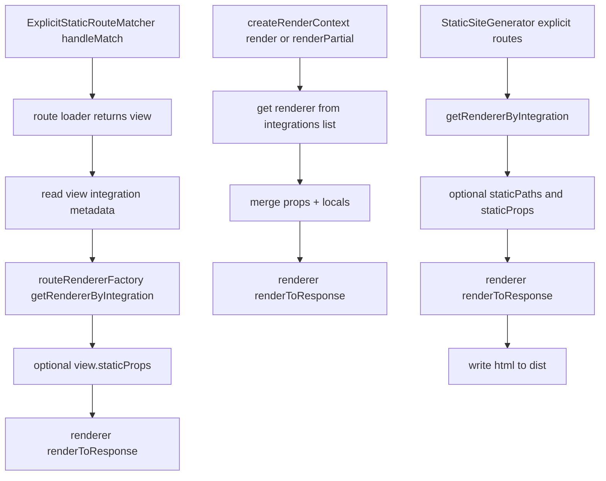

## 7) Current Concrete Integration in core

Today the concrete in-core renderer is `GhtmlRenderer`. That makes it a useful reference implementation for the abstract integration renderer contract.

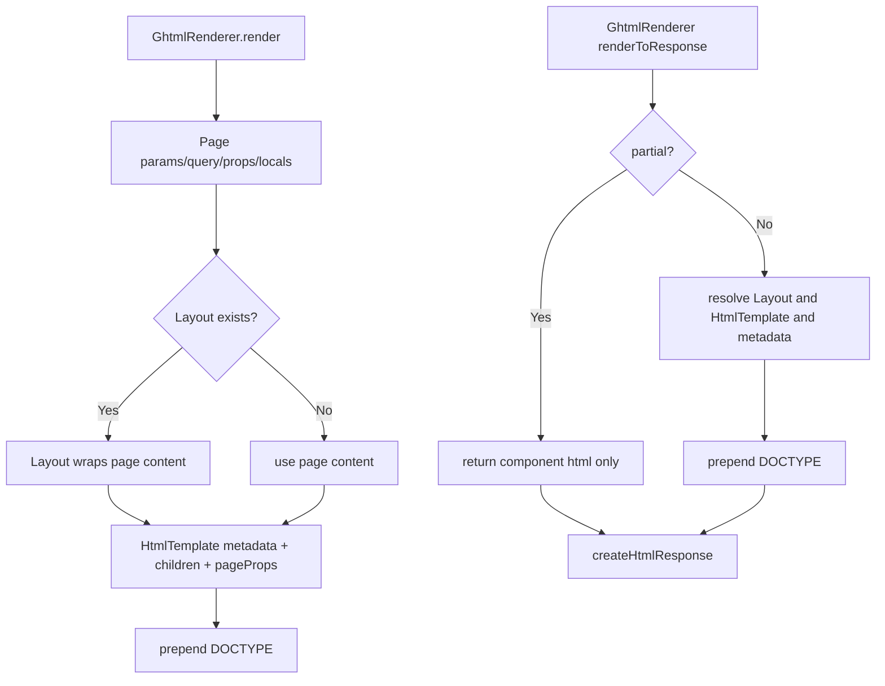

## 8) Reading Order

For someone new to the rendering system, this is probably the most useful order to read the code:

1. `server-route-handler.ts`
2. `fs-server-response-matcher.ts`
3. `file-route-middleware-pipeline.ts`
4. `page-request-cache-coordinator.service.ts`
5. `route-renderer.ts`
6. `integration-renderer.ts`
7. `render-preparation.service.ts`
8. `render-execution.service.ts`
9. `queued-boundary-runtime.service.ts`
10. `html-transformer.service.ts`
11. `page-module-loader.ts`
12. `dependency-resolver.ts`
13. `eco.ts`
14. `component-render-context.ts`

## 9) Key Files

- `packages/core/src/adapters/shared/server-adapter.ts`
- `packages/core/src/adapters/shared/server-route-handler.ts`
- `packages/core/src/adapters/shared/fs-server-response-matcher.ts`
- `packages/core/src/adapters/shared/file-route-middleware-pipeline.ts`
- `packages/core/src/adapters/shared/fs-server-response-factory.ts`
- `packages/core/src/adapters/shared/explicit-static-route-matcher.ts`
- `packages/core/src/adapters/shared/render-context.ts`
- `packages/core/src/route-renderer/route-renderer.ts`
- `packages/core/src/route-renderer/orchestration/integration-renderer.ts`
- `packages/core/src/route-renderer/orchestration/render-preparation.service.ts`
- `packages/core/src/route-renderer/orchestration/render-execution.service.ts`
- `packages/core/src/route-renderer/orchestration/queued-boundary-runtime.service.ts`
- `packages/core/src/route-renderer/page-loading/page-module-loader.ts`
- `packages/core/src/route-renderer/page-loading/dependency-resolver.ts`
- `packages/core/src/services/module-loading/page-module-import.service.ts`
- `packages/core/src/services/cache/page-request-cache-coordinator.service.ts`
- `packages/core/src/eco/component-render-context.ts`
- `packages/core/src/eco/eco.ts`
- `packages/core/src/services/html-transformer.service.ts`
- `packages/core/src/services/cache/page-cache-service.ts`
- `packages/core/src/integrations/ghtml/ghtml-renderer.ts`
