# Rendering Logic Graph

This document maps the end-to-end rendering logic in core, including request-time rendering, explicit route rendering, static generation, and marker graph orchestration.

## Design Principles

These diagrams are based on a few architectural assumptions that seem important to preserve:

- **Rendering entry points are separate, but should converge on shared renderer contracts.**
  Request-time page rendering, explicit view rendering, and static generation all eventually depend on the same integration renderer behavior.
- **Integration choice should remain a boundary concern.**
  Adapters and route matchers decide which renderer to use; once selected, the integration renderer owns the page render pipeline.
- **Data resolution should happen before HTML transformation.**
  Static props, metadata, dependency processing, and route assets are all upstream of final HTML injection.
- **Marker graph orchestration should be a post-render reconciliation step.**
  The initial integration render may emit deferred component markers; those are resolved after the first HTML pass, not during route matching.
- **Caching policy is authoritative at the page layer.**
  Middleware, locals, and response reuse all depend on the effective page cache strategy.
- **Asset emission should converge into one injection stage.**
  Route-level assets, integration assets, page-root component assets, and marker-generated assets all end up in the HTML transformer.

## Entry Points

There are three main rendering entry points:

1. **Runtime request rendering**
    - handled through the server adapters and file-system route matching
2. **Explicit rendering APIs**
    - handled through `renderToResponse()` and route-handler render context helpers
3. **Static site generation**
    - handled through explicit route generation and route renderer reuse at build time

## 1) Runtime Request Flow (Bun and Node)

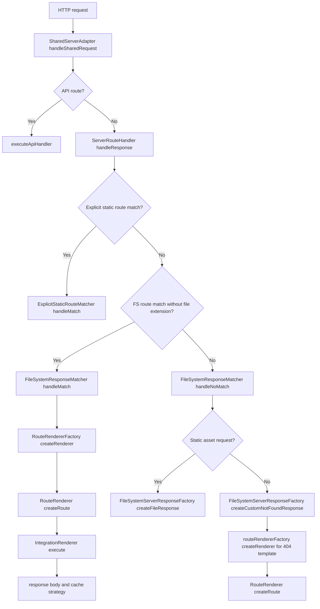

## 2) FS Route Rendering + Middleware + Cache

This is the most operationally important runtime path because it is where middleware, locals, and cache behavior are coordinated.

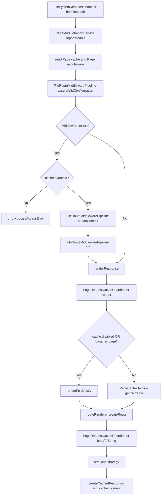

## 3) RouteRendererFactory Selection Logic

This is a small but important boundary. It centralizes integration selection and renderer reuse, which helps keep adapter code thin.

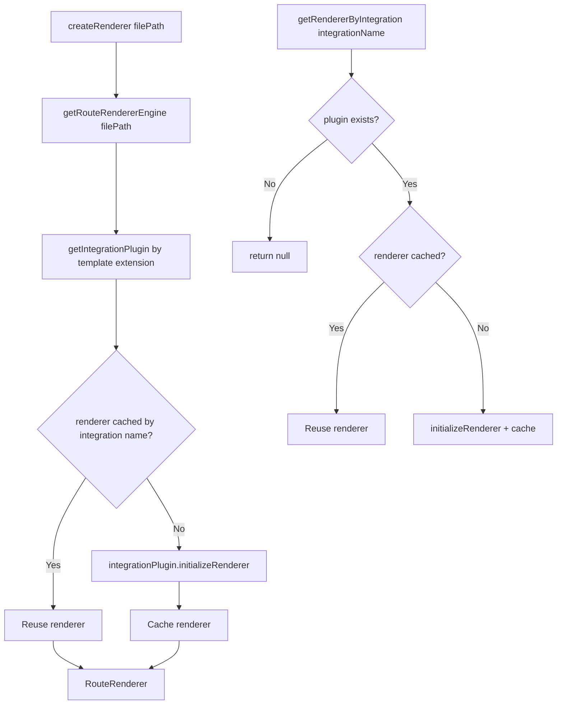

## 4) IntegrationRenderer Pipeline

The original single graph was accurate but a bit dense. Splitting it into preparation and execution phases makes the orchestration easier to reason about.

### 4.1 Render preparation via `RenderPreparationService`

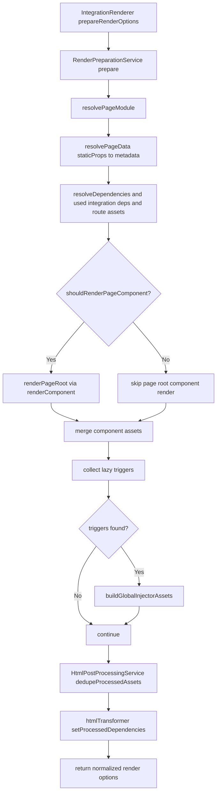

### 4.2 Main execute flow via `RenderExecutionService`

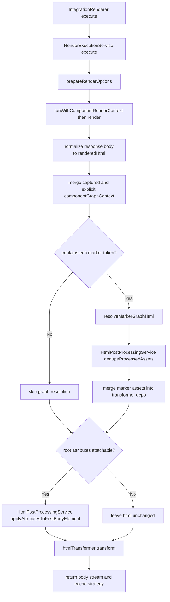

### 4.3 Render preparation responsibilities

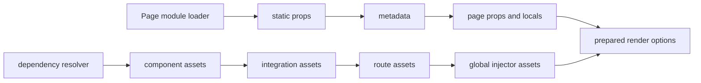

### 4.4 Service boundary map

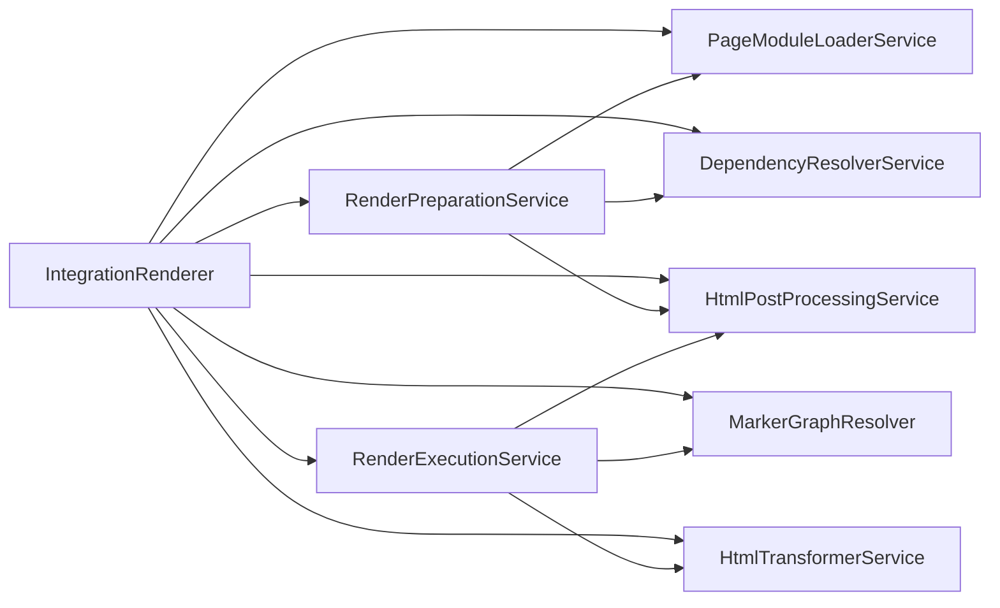

## 5) Marker Emission + Graph Resolution

This part is architecturally interesting because it introduces a second render stage. The first pass captures boundaries; the second pass resolves them in dependency order.

### 5.1 Marker emission in `eco.component` factory

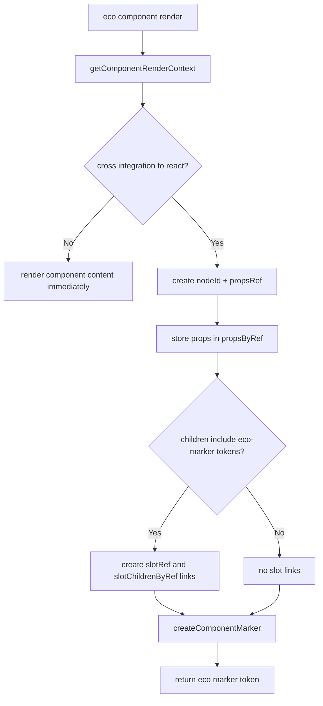

### 5.2 Marker graph execution

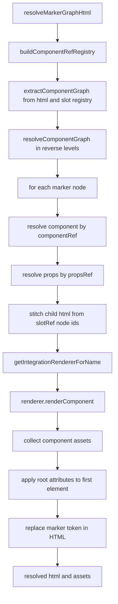

## 6) Explicit Rendering Paths (outside FS page matching)

These paths are simpler than request-time file-system rendering because they bypass most router and cache orchestration.

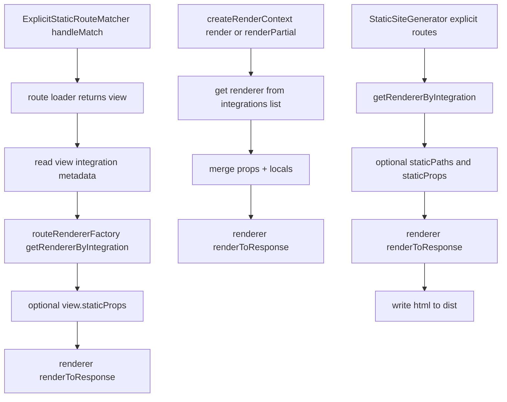

## 7) Current Concrete Integration in core

Today the concrete in-core renderer is `GhtmlRenderer`. That makes it a useful reference implementation for the abstract integration renderer contract.

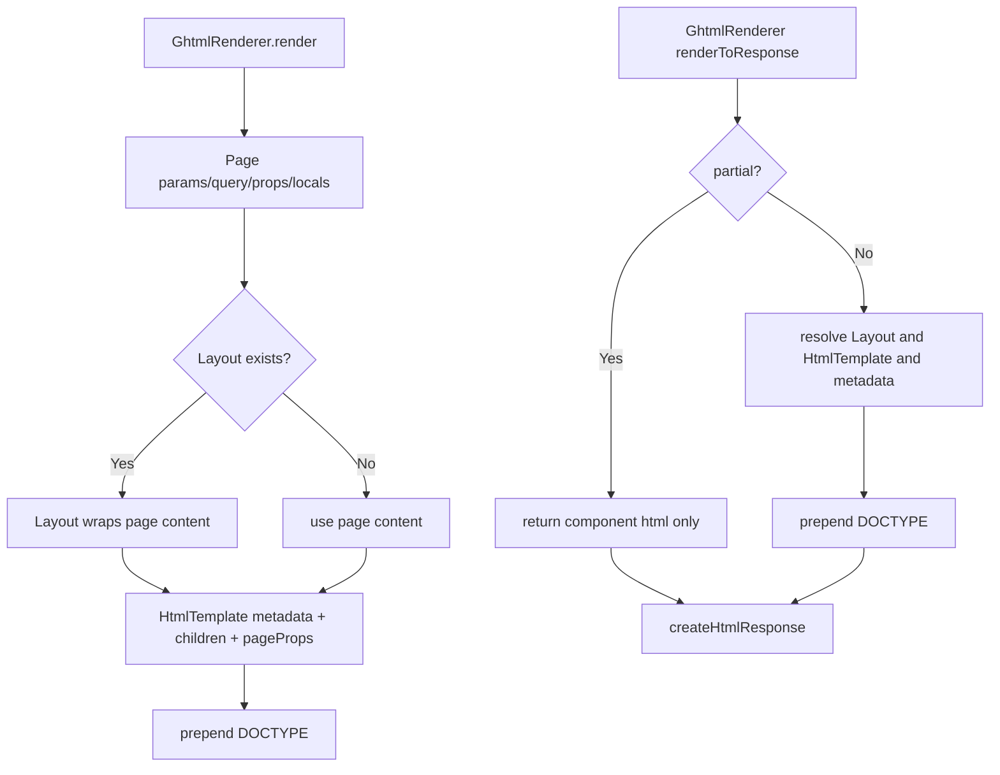

## 8) Reading Order

For someone new to the rendering system, this is probably the most useful order to read the code:

1. `server-route-handler.ts`
2. `fs-server-response-matcher.ts`
3. `file-route-middleware-pipeline.ts`
4. `page-request-cache-coordinator.service.ts`
5. `route-renderer.ts`
6. `integration-renderer.ts`
7. `render-preparation.service.ts`
8. `render-execution.service.ts`
9. `marker-graph-resolver.ts`
10. `html-post-processing.service.ts`
11. `page-module-loader.ts`
12. `dependency-resolver.ts`
13. `component-marker.ts`
14. `component-graph.ts`
15. `component-graph-executor.ts`
16. `eco.ts`
17. `component-render-context.ts`
18. `html-transformer.service.ts`

## 9) Key Files

- `packages/core/src/adapters/shared/server-adapter.ts`
- `packages/core/src/adapters/shared/server-route-handler.ts`
- `packages/core/src/adapters/shared/fs-server-response-matcher.ts`
- `packages/core/src/adapters/shared/file-route-middleware-pipeline.ts`
- `packages/core/src/adapters/shared/fs-server-response-factory.ts`
- `packages/core/src/adapters/shared/explicit-static-route-matcher.ts`
- `packages/core/src/adapters/shared/render-context.ts`
- `packages/core/src/route-renderer/route-renderer.ts`
- `packages/core/src/route-renderer/integration-renderer.ts`
- `packages/core/src/route-renderer/render-preparation.service.ts`
- `packages/core/src/route-renderer/render-execution.service.ts`
- `packages/core/src/route-renderer/html-post-processing.service.ts`
- `packages/core/src/route-renderer/marker-graph-resolver.ts`
- `packages/core/src/route-renderer/component-marker.ts`
- `packages/core/src/route-renderer/component-graph.ts`
- `packages/core/src/route-renderer/component-graph-executor.ts`
- `packages/core/src/route-renderer/page-module-loader.ts`
- `packages/core/src/route-renderer/dependency-resolver.ts`
- `packages/core/src/services/page-module-import.service.ts`
- `packages/core/src/services/page-request-cache-coordinator.service.ts`
- `packages/core/src/eco/component-render-context.ts`
- `packages/core/src/eco/eco.ts`
- `packages/core/src/services/html-transformer.service.ts`
- `packages/core/src/services/cache/page-cache-service.ts`
- `packages/core/src/integrations/ghtml/ghtml-renderer.ts`
