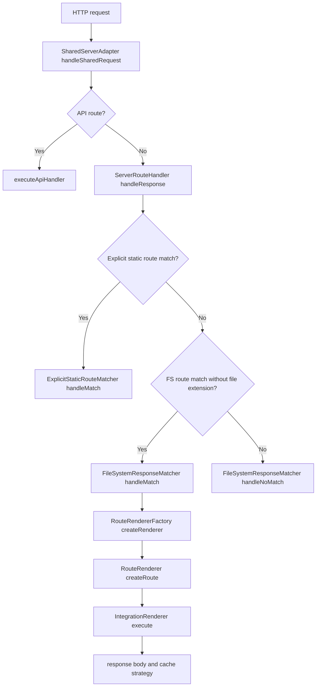
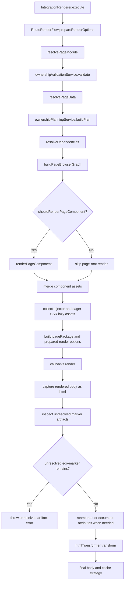
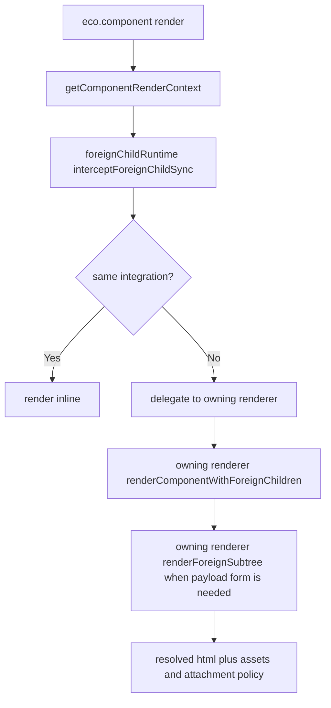
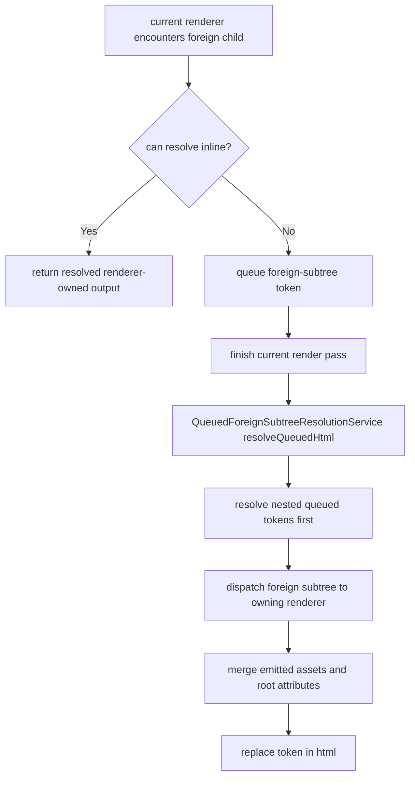
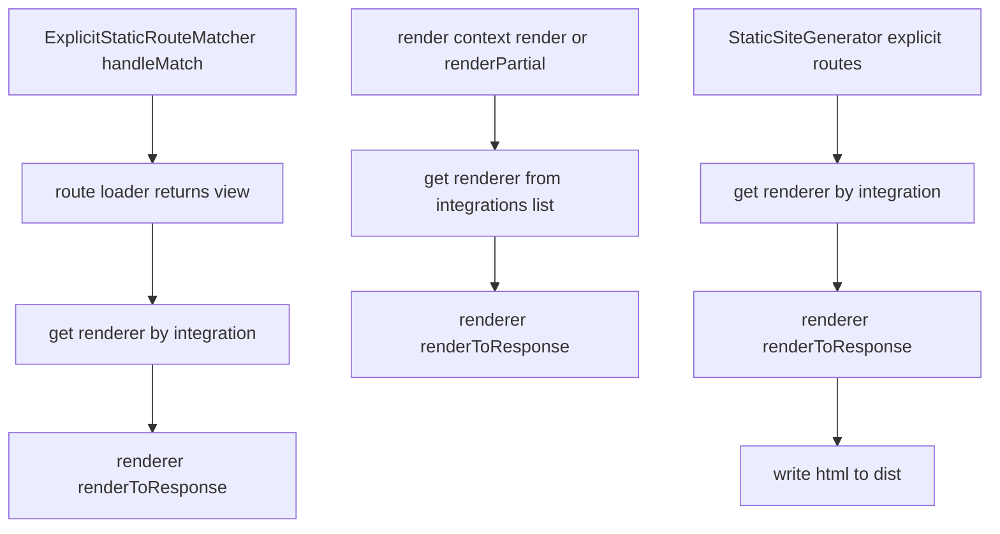

# Rendering Logic Graph

This document maps the rendering logic in core using the ownership, foreign-child, and foreign-subtree model.

## Design Principles

- Rendering entry points stay separate, but they converge on the same integration renderer contracts.
- Integration selection happens outside the renderer. Once selected, the integration renderer owns the render pipeline.
- Ownership is preparation-time metadata. Runtime handoff still happens inside renderer-owned foreign-child interception.
- Route-level fallback resolution is gone. Unresolved `<eco-marker>` artifacts are now a failure signal.
- Asset emission converges into one final HTML transformation step.

## 1) Runtime Request Flow

## 2) Route Render Flow

`IntegrationRenderer.execute()` delegates shared route orchestration to `RouteRenderFlow`.

## 3) Mixed-Integration Render Model

The renderer-level mental model is:

1. declared dependencies describe ownership
2. active render context intercepts foreign children
3. the owning renderer returns a foreign subtree

## 4) Queued Foreign-Subtree Resolution

Some renderers cannot hand off foreign children inline. Those renderers can use the queue service during one render pass.

## 5) Explicit Rendering Paths

These paths bypass most filesystem routing, but they still converge on the same renderer contracts.

## 6) Reading Order

The most useful reading order is:

1. `route-renderer.ts`
2. `orchestration/route-render-flow.ts`
3. `orchestration/integration-renderer.ts`
4. `orchestration/ownership-validation.service.ts`
5. `orchestration/ownership-planning.service.ts`
6. `orchestration/component-render-context.ts`
7. `orchestration/queued-foreign-subtree-resolution.service.ts`
8. `page-loading/page-module-loader.ts`
9. `page-loading/dependency-resolver.ts`
10. `eco/eco.ts`

## 7) Key Files

- `packages/core/src/route-renderer/route-renderer.ts`
- `packages/core/src/route-renderer/orchestration/route-render-flow.ts`
- `packages/core/src/route-renderer/orchestration/integration-renderer.ts`
- `packages/core/src/route-renderer/orchestration/ownership-validation.service.ts`
- `packages/core/src/route-renderer/orchestration/ownership-planning.service.ts`
- `packages/core/src/route-renderer/orchestration/component-render-context.ts`
- `packages/core/src/route-renderer/orchestration/queued-foreign-subtree-resolution.service.ts`
- `packages/core/src/route-renderer/page-loading/page-module-loader.ts`
- `packages/core/src/route-renderer/page-loading/dependency-resolver.ts`
- `packages/core/src/eco/eco.ts`
